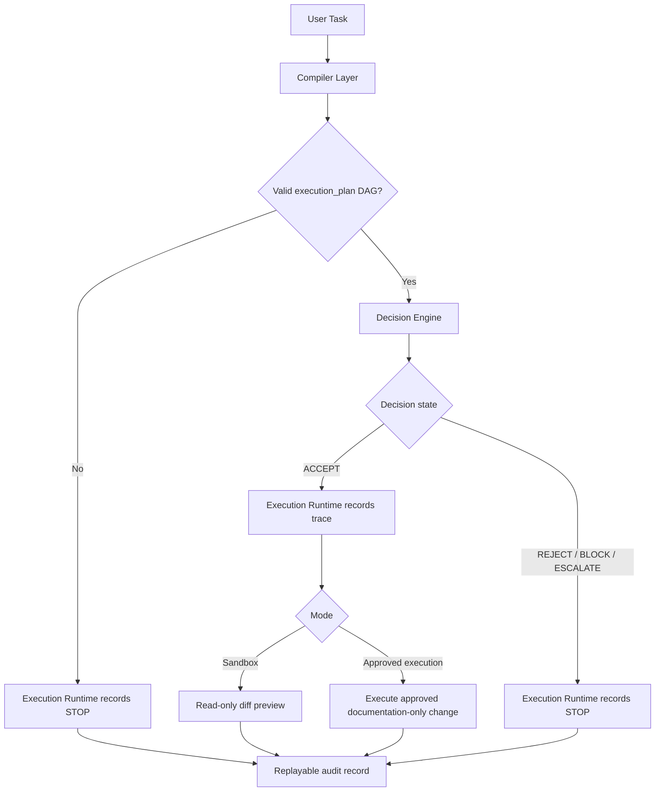

# Execution System Consolidation

## 1. Purpose

This document consolidates the current execution-control documentation architecture for A股监控系统 v3 into a simplified three-layer model.

The consolidation is documentation-only. It does not modify runtime code, database schema, N1-N6 architecture, command execution, worker behavior, outbox behavior, rollback behavior, or any live system state.

The goal is to reduce conceptual overlap while preserving:

```text
determinism
safety constraints
execution traceability
DAG correctness
layer boundary enforcement
```

## 2. Current System

The current execution-control design is split across seven conceptual layers:

```text
Execution Compiler
Execution Kernel
Runtime Gate
Binding Layer
Execution Trace
State Machine
Execution Sandbox
```

These layers are safe but redundant. Several layers repeat decision, enforcement, ordering, and audit rules.

## 3. Target System

The target architecture has only three layers:

```text
Compiler Layer
Decision Engine
Execution Runtime
```

### 3.1 Compiler Layer

Responsibilities:

```text
convert natural language task -> execution_plan DAG
validate DAG structure
ensure PLAN -> VALIDATE -> MODIFY -> VERIFY -> FINALIZE shape
ensure every MODIFY is preceded by VALIDATE
reject cycles
reject cross-layer DAG nodes
```

Inputs:

```text
user task
project constraints
allowed affected_files
declared layer_role
```

Outputs:

```text
execution_plan
validated DAG status
compiler diagnostics
```

### 3.2 Decision Engine

The Decision Engine is the unified core.

Merged responsibilities:

```text
Execution Kernel
Runtime Gate
Binding Layer
```

Responsibilities:

```text
decision making
enforcement
safety validation
layer boundary checks
runtime execution prohibition checks
file scope checks
cross-layer mutation detection
decision ordering validation
```

Output states:

```text
ACCEPT
REJECT
BLOCK
ESCALATE
```

The Decision Engine is the only layer allowed to produce final decision states.

### 3.3 Execution Runtime

Merged responsibilities:

```text
Execution Trace
State Machine
Execution Sandbox
```

Responsibilities:

```text
execution lifecycle tracking
audit / trace recording
simulation / sandbox mode
replay support
state transition validation
diff preview in sandbox mode
failure point recording
decision origin recording
```

Execution Runtime does not authorize execution by itself. It records and replays what the Compiler Layer and Decision Engine decided.

## 4. Redundant Layer Identification

| Redundant area | Current layers involved | Consolidated owner | Reason |
|---|---|---|---|
| Decision states | Execution Kernel, Runtime Gate, Binding Layer | Decision Engine | All three repeat ACCEPT / REJECT / BLOCK / ESCALATE or equivalent stop logic. |
| Boundary enforcement | Execution Kernel, Runtime Gate, Binding Layer, Sandbox | Decision Engine | Cross-layer, file scope, and runtime execution checks should have one owner. |
| Invocation ordering | Runtime Gate, Binding Layer, State Machine | Decision Engine | Ordering is an enforcement concern until a final decision is produced. |
| Lifecycle states | State Machine, Execution Trace, Sandbox | Execution Runtime | State transitions, trace records, and sandbox replay all describe lifecycle history. |
| Audit recording | Execution Trace, State Machine, Sandbox | Execution Runtime | Trace, replay, and failure point recording are one audit surface. |
| Simulation | Execution Sandbox, State Machine, Execution Trace | Execution Runtime | Sandbox is a runtime mode that records hypothetical lifecycle and diffs. |
| DAG validation | Execution Compiler, Sandbox | Compiler Layer | DAG shape and acyclicity should be compiler responsibility. |

## 5. Old Layer to New Layer Mapping

| Old layer | New layer | Status after consolidation |
|---|---|---|
| Execution Compiler | Compiler Layer | Kept as the only planning / DAG layer. |
| Execution Kernel | Decision Engine | Merged into unified decision logic. |
| Runtime Gate | Decision Engine | Merged into unified enforcement logic. |
| Binding Layer | Decision Engine | Merged into unified ordering and non-bypass validation. |
| Execution Trace | Execution Runtime | Merged into audit / trace recording. |
| State Machine | Execution Runtime | Merged into lifecycle tracking and replay. |
| Execution Sandbox | Execution Runtime | Merged as simulation mode and diff preview. |

## 6. Responsibility Mapping

| Responsibility | Compiler Layer | Decision Engine | Execution Runtime |
|---|---:|---:|---:|
| Natural language task parsing | Yes | No | No |
| Generate `execution_plan` DAG | Yes | No | No |
| Validate DAG nodes and edges | Yes | No | No |
| Detect DAG cycles | Yes | No | No |
| Validate `PLAN -> VALIDATE -> MODIFY -> VERIFY -> FINALIZE` | Yes | No | No |
| Convert validated plan into decision input | Yes | No | No |
| Produce ACCEPT / REJECT / BLOCK / ESCALATE | No | Yes | No |
| Enforce layer boundary | No | Yes | No |
| Detect cross-layer mutation | No | Yes | No |
| Detect runtime execution request | No | Yes | No |
| Validate file scope | No | Yes | No |
| Enforce non-bypass ordering | No | Yes | No |
| Track lifecycle state | No | No | Yes |
| Record trace | No | No | Yes |
| Record STOP / failure point | No | No | Yes |
| Provide sandbox simulation | No | No | Yes |
| Provide read-only diff preview | No | No | Yes |
| Support replay | No | No | Yes |

## 7. Conceptual Removal of Overlapping Decision Logic

The following overlaps are removed conceptually:

```text
Runtime Gate no longer owns a second independent decision model.
Binding Layer no longer owns a third independent decision model.
Execution Trace no longer duplicates decision state validation.
State Machine no longer decides whether execution is allowed.
Sandbox no longer redefines Kernel / Gate / Binding decisions.
```

After consolidation:

```text
Compiler Layer decides whether the task has a valid DAG.
Decision Engine decides whether the task is allowed.
Execution Runtime records, simulates, tracks, and replays.
```

Only the Decision Engine owns:

```text
ACCEPT
REJECT
BLOCK
ESCALATE
```

Execution Runtime may record these states, but must not reinterpret them.

## 8. Deterministic Flow



Text flow:

```text
User Task
  -> Compiler Layer
  -> validated execution_plan DAG
  -> Decision Engine
  -> ACCEPT / REJECT / BLOCK / ESCALATE
  -> Execution Runtime
  -> trace / state / sandbox / replay
  -> EXECUTE or STOP
```

## 9. Determinism Rules

```text
No task proceeds without a valid execution_plan DAG.
No task proceeds without a Decision Engine state.
No task executes unless Decision Engine returns ACCEPT.
No task executes without Execution Runtime trace recording.
All STOP outcomes must be traceable to the first failure point.
Replay must reconstruct Compiler Layer output, Decision Engine state, and Execution Runtime path.
```

## 10. Safety Constraints Preserved

The consolidated system preserves the existing hard safety constraints:

```text
No runtime code changes from this consolidation.
No database or schema changes from this consolidation.
No worker startup.
No outbox consumption.
No rollback execution.
No N1-N6 state mutation.
No cross-layer operation.
No execution without DAG correctness.
No execution without decision ACCEPT.
No execution without traceability.
```

## 11. Consolidated Output Contract

A consolidated execution record should contain:

```yaml
execution_record:
  compiler_layer:
    execution_plan: {}
    dag_valid: true
    compiler_reason: "string"

  decision_engine:
    state: ACCEPT | REJECT | BLOCK | ESCALATE
    reason: "string"
    safety_checks:
      layer_boundary: passed | failed
      file_scope: passed | failed
      runtime_execution: absent | present
      cross_layer_mutation: absent | present

  execution_runtime:
    mode: sandbox | approved_execution | stopped
    lifecycle_state: TRACE_RECORDED | EXECUTED | STOPPED
    trace_recorded: true
    failure_point: string | null
    replay_supported: true
```

## 12. Non-Goals

This consolidation does not:

```text
delete existing documents
modify AGENTS.md
modify runtime code
modify N1-N6 design
modify database schema
execute commands
create workers
change event contracts
change trigger/action/user semantics
```

Existing detailed documents may remain as historical or reference material. This document defines the consolidated target architecture for future documentation alignment.

## 13. Final Architecture Summary

```text
Compiler Layer
  owns task -> DAG

Decision Engine
  owns ACCEPT / REJECT / BLOCK / ESCALATE

Execution Runtime
  owns trace / lifecycle / sandbox / replay
```

This three-layer structure reduces system complexity while preserving determinism, safety constraints, execution traceability, and DAG correctness.
