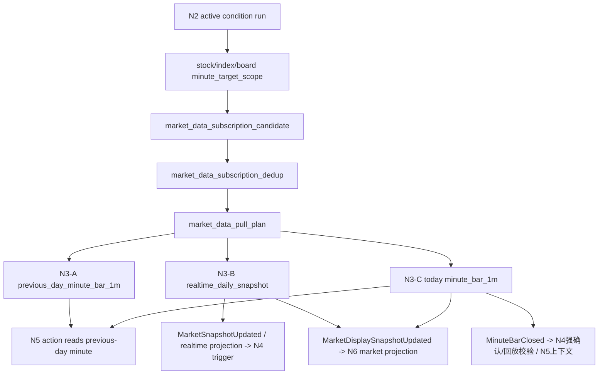

# A股监控系统 v3 N3 实时行情层开发文档

版本：V0.1
日期：2026-05-23
阶段：N3 实时行情层

## 1. N3 目标

N3 的目标是把 N2 条件层产出的 `minute_target_scope` 转换成可执行、可审计、可回滚的行情订阅和行情事实。

N3 只回答四个问题：

```text
1. 哪些对象需要行情。
2. 每个对象需要哪种行情：实时日 K / 今日 1 分钟 K / 前一交易日 1 分钟 K。
3. 行情应该从哪里统一拉取、写入哪里、质量如何。
4. 后续触发层和动作层如何只读这些行情事实。
```

N3 不负责：

```text
条件计算
触发判断
动作生成
语音播报
mobile projection
用户卡片
模拟账户
真实交易
长期 worker 启动
```

一句话边界：

```text
N3 是统一行情事实层，不是触发层，也不是动作层。
```

## 1.1 Source-Returned Time Policy

N3 盘中 readiness 以行情源返回的 source time 为准，不以本机 wall-clock 时间作为硬门槛。

```text
source_time_policy=source_returned_time
```

适用范围：

```text
N3-B1 realtime_daily_snapshot
N3P trigger proof
N3-B2 direct 30m K projection proof
```

规则：

```text
1. 如果 09:20 后行情源已经返回 for_trade_date 对应的 09:31 snapshot / K row，
   N3 可以把该 source-returned row 作为可追溯输入。
2. N3 不因为本机时间尚未到 09:31 而阻断 source-ready 的 B1/N3P。
3. N3-B2 不因为 30m 窗口尚未闭合而阻断 direct 30m projection proof；
   source_30m_k_closed_status=projected。
4. source trade_date 必须等于 for_trade_date。
5. 跨交易日 source time、非交易窗口 source time、fake/synthetic/fabricated source row 必须 fail closed。
6. local_observed_at / fetched_at 默认只作为 trace；只有本文明确列出的 reviewed
   index/board normalization 或 stock fallback 例外可以把它用作 effective source_snapshot_time。
```

Index / board B1 例外政策：

```text
mootdx index(frequency=9) 用于 index / board snapshot 时返回的 datetime 是日线/周期 label，
不是可信 realtime tick/update timestamp。

在 B1 reviewed contract 明确包含以下字段时：
  source_time_policy.mode=source_returned_time
  untrusted_source_time_label_handling=NORMALIZE_TO_OBSERVED_AT
  index_board_period_label_policy=normalize_to_observed_at_trace_raw_label
  index_board_only_normalization=true

N3-B1 允许仅对 asset_kind=index/board 且 raw label 满足：
  source_time_trust_level=untrusted_period_label
  raw_snapshot_time_semantics=tdx_index_frequency_9_period_label

使用 observed_at/fetched_at 作为 effective source_snapshot_time。
raw_snapshot_time_label / raw_snapshot_time_semantics / source_time_trust_level 必须保留在 raw_json trace。
stock 不适用该 normalization；stock untrusted period label 继续 fail closed。
fake/synthetic/fabricated、source trade_date mismatch、非交易窗口 source time 继续 fail closed。
```

Stock B1 例外政策：

```text
mootdx stock quotes() payload 当前未提供可信 exchange tick/update timestamp。

在 B1 reviewed contract 明确包含以下字段时：
  source_time_policy.mode=source_returned_time
  stock_missing_source_time_policy=observed_at_fallback_when_effective_quote_present
  stock_observed_at_fallback=true
  stock_trusted_source_timestamp_required=false
  stock_fallback_quality_severity=P1

N3-B1 允许仅对 asset_kind=stock 且满足以下条件的 quote 使用 observed_at/fetched_at 作为
effective source_snapshot_time：
  raw payload 没有可信 source timestamp
  quote 有有效价格或有效成交字段
  observed_at/fetched_at 映射到 for_trade_date 的交易窗口
  raw payload 不含 fake/synthetic/fabricated marker

该 fallback 必须记录：
  source_time_status=source_time_observed_at_fallback
  source_time_warning=true
  trusted_source_timestamp_present=false
  stock_source_time_fallback_reason=missing_trusted_source_timestamp

该时间是 N3 B1 source observation time，不是交易所原生 timestamp。
显式 source timestamp 跨交易日、无有效 quote、fake/synthetic/fabricated source row 继续 fail closed。
index/board 不适用该 stock fallback；它们只使用上文 period-label normalization policy。
```

该策略不授权真实拉行情、不写下游、不消费 outbox/inbox/checkpoint；只定义 N3 对 source timestamp 的合法性判断。

正式 proof contract：

```text
B1:
  source_time_policy.mode=source_returned_time
  source_time_required=true
  local_observed_at_trace_only=true
  untrusted_source_time_label_handling=NORMALIZE_TO_OBSERVED_AT
  index_board_period_label_policy=normalize_to_observed_at_trace_raw_label
  index_board_only_normalization=true
  stock_missing_source_time_policy=observed_at_fallback_when_effective_quote_present
  stock_observed_at_fallback=true
  stock_trusted_source_timestamp_required=false
  stock_fallback_quality_severity=P1
  quality_gate_code=BLOCKED_N3_SOURCE_RETURNED_TIME_INVALID

N3P:
  metric_role=trigger_proof
  proof_owner=N3
  proof_consumer=N4
  not_n5_final_proof=true
  proof_input_time_source=B1_source_snapshot_time
  source_mode=b1_source_returned_snapshot
  source_time_policy=source_returned_time
  source_variant=b1_source_returned_snapshot_amount_chain_v2_asset_unit_fix_v1
  target until_hhmm 必须从 B1 实际 proof_input_time / source_snapshot_time 推导
  source_today_minute_run_id 可作为兼容 alias 等于 source_snapshot_run_id
  source_today_minute_run_id_compat_policy=b1_source_returned_snapshot_alias
  raw_target_minute_label / observed_at / source_snapshot_time 必须保留 trace
  禁止把 09:55 snapshot 伪装成 09:31 N3P；target until 与 proof_input_time 不一致必须 fail closed
  禁止用 live_current_1m* source_variant 标记 B1 source-returned snapshot lineage
  对该 source_variant，metric_ready 表示 N4 ordinary trigger proof ready，不表示 N5 action-confirmation ready
  previous_5m / current_5m / 30m / 120m segment proof 缺失不得阻断 N4 ordinary trigger proof
  segment/action-confirmation 缺失必须进入 action_confirmation_blocked_reasons 与 trace
  DB legacy segment-source 列仍使用旧 CHECK 约束；该 variant 的 DB-facing previous_1m/5m/30m/120m_period_source
  必须写为 not_available，并在 raw_json/trace_json.trigger_proof_segment_source_db_compat 保留
  not_required_for_trigger_proof 语义和原始 segment source。
  action_confirmation_ready=false
  action_confirmation_ready_reason=not_n5_final_proof
  previous_5m_required_for_trigger_proof=false
  previous_5m_status=not_required_for_trigger_proof
  segment_30m_status=not_required_for_trigger_proof
  segment_120m_status=not_required_for_trigger_proof
  missing current_price / current_amount / proof_input_time / N4 period baseline / required amount-chain seed / unit proof 仍必须 fail closed

N3P trigger-proof realtime input model:
  source_model=n3p_trigger_proof_realtime_v1
  该模型只服务 N4 ordinary trigger proof，不服务 N5 ActionExecuted final proof
  stock 当前输入来自 mootdx quotes() 的 price/open/high/low/amount/servertime
  stock quotes().amount 按当日累计成交额解释，stock quote 拉取计划单批最多 80 symbols
  stock quote 若 price/open/high/low/volume 全为 0，或 price/open/high/low 任一字段 <= 0，
  只能作为 source evidence 保留，不得作为 ready trigger proof；metric_ready=false，
  action_confirmation_ready=false，blocked_reasons 必须包含 stock_quote_zero_price_ohlc_volume。
  N3P trigger-proof preflight 必须将 stock_quote_zero_price_ohlc_volume 作为显式 expected not_ready
  reason 处理；该 reason 只允许对应 stock quote zero-price evidence，不得放宽未知 not_ready reason。
  trace/raw_json 必须保留 source_quote_servertime、canonical_proof_minute、
  source_quote_zero_price_ohlc_volume=true 与原始 stock_quote_source_values，不得补价、补量、
  补 open/high/low 或丢弃该 evidence row。
  09:25+ 非 0 stock quote 可在其他条件全部满足时进入 metric_ready=true；09:31 前的
  stock quote canonical proof minute 仍按 stock_quote_servertime_to_a1_canonical_proof_minute_v1 映射到 09:31。
  index/board 当前输入来自 mootdx index(frequency=8) 的当日 1m rows
  index/board 1m amount 按单分钟成交额解释，必须先过滤到 proof_input_time 再累计
  stock zero-quote quality guard 不适用于 index/board frequency=8 1m rows。
  N3P mixed source 的 stock canonical proof minute 与 index/board frequency=8 latest minute 必须对齐；
  不得把 stock relabel 到 index/board，也不得把 index/board relabel 到 stock。若二者只相差 1 分钟，
  source provider 必须 fail closed 并标记 alignment_failure_class=adjacent_minute_source_boundary_race，
  poller 可在 artifact/register/write 之前 bounded retry N3P source fetch；默认最多 2 次、间隔 2 秒，
  每次尝试必须写入 retry trace。若 retry 后对齐则继续；若耗尽仍不对齐则 fail closed 为
  BLOCKED_N3P_SOURCE_CANONICAL_MINUTE_ALIGNMENT_RETRY_EXHAUSTED。若相差超过 1 分钟或任一侧缺失，
  必须立即按 canonical minute mismatch / missing-data policy 阻断，不得 retry 或静默补齐。
  午后边界唯一允许的显式等待态是 stock quote canonical minute 仍为 11:30、而 index/board frequency=8
  最新分钟已为 13:00。该场景表示 stock quote servertime 午间滞后，不得把 11:30 relabel 为 13:00，
  不得注册 source payload，不得生成 N3P proof；provider 必须返回
  BLOCKED_N3P_SOURCE_MIDDAY_STOCK_TIME_STALE，reason=stock_quote_servertime_stale_at_midday_wait_for_alignment，
  等待后续 source 自然对齐。
  current_elapsed_amount_yuan 是 stock quotes cumulative amount 或 index/board 1m cumulative amount 的统一标准字段
  today_virt_amount = current_elapsed_amount / previous_day_same_elapsed_amount * previous_day_full_amount
  A1 previous-day same elapsed window 必须按 canonical A 股交易分钟标签对齐
  canonical 1m labels = 09:31..11:29 + 13:00..15:00，共 240 根
  禁止生成 11:30 fake bar；11:29 后下一根是 13:00
  A1 previous-day raw 11:30 midday bridge label 可在 N3P mixed realtime 输入边界归一为 canonical 13:00
  normalization_policy=previous_day_midday_bridge_1130_to_1300_v1
  该归一化不新增 bar、不复制 bar，必须保留 raw_bar_time=11:30 与 canonical_bar_time=13:00 trace
  同一对象同日同时存在 raw 11:30 与 raw 13:00 必须 fail closed，归一化后 canonical labels 仍不完整也必须 fail closed
  A1 raw previous-day 1m rows 继续作为审计事实保留，不删除、不替代
  N3P mixed realtime 可以优先消费 previous_day_cumulative_rows：
    key=asset_kind + identity_key + canonical_minute_label
    fields=previous_day_elapsed_amount / previous_day_full_amount / elapsed_count / full_count
    trace=raw_first_label / raw_last_label / normalization_policy / source_previous_day_minute_run_id
  当输入来自 stock/index/board_previous_day_minute_cumulative DB 表时，N3P 必须先经只读 loader
  显式 alias：
    cumulative_amount_yuan -> previous_day_elapsed_amount
    full_day_amount_yuan -> previous_day_full_amount
  loader 只读取 proof_minute_label 对应 canonical_minute_label，不扫描 raw A1 1m 明细；
  loader 必须保留 raw/canonical trace、source_amount_unit、canonical_amount_unit、unit_conversion_factor。
  DB 原始字段名不得直接泄漏给 builder 作为 N3P payload 顶层金额字段。
  当 contract 要求 require_previous_day_cumulative_rows=true 时，缺少对应 cumulative row 必须 fail closed
  该模式禁止静默 fallback 到全量 raw A1 rows；raw fallback 仅作为未启用 cumulative contract 的兼容/debug 路径
  N3-A1 可以将 raw previous_day_minute_bar_1m 预聚合为标准 cumulative amount product：
    physical tables=stock_previous_day_minute_cumulative / index_previous_day_minute_cumulative / board_previous_day_minute_cumulative
    unique key=source_previous_day_minute_run_id + identity_key + canonical_minute_label
    canonical labels=09:31..11:29 + 13:00..15:00，共 240 根
    raw 11:30 -> canonical 13:00 仅限 previous-day midday bridge policy，不新增 bar、不复制 bar
    stock source_amount_unit=thousand_yuan 时必须乘以 1000 转为 cumulative_amount_yuan
    index/board source_amount_unit=yuan passthrough，unit_conversion_factor=1
    output fields=cumulative_amount_yuan / full_day_amount_yuan / elapsed_count / full_count / raw_json / trace_json
    raw 11:30 与 raw 13:00 同时存在、canonical label 缺失、fake/synthetic/fabricated source row、跨物理资产来源混入均 fail closed
  N3P 执行 fastlane 应优先读取 proof_minute 对应 cumulative rows，避免每轮扫描 455520 条 A1 raw 1m rows
  missing current_price / current_elapsed_amount / source time / A1 same window / N4 baseline 仍必须 fail closed
  source trace 必须记录 adapter method、raw source time、proof_input_minute、amount_source_kind、A1 aligned refs
  若 mixed realtime source payload 以本地 artifact 形式进入 N3P execute，必须先登记独立 N3 source lineage run：
    run_id=n3p_mixed_realtime_source_payload_<YYYYMMDD>_until_<HHMM>_v1

    stage=N3P_mixed_realtime_source_payload_registration
    source_origin=local_mootdx_fetch_artifact
    source_model=n3p_trigger_proof_realtime_v1
    writes_outbox=false
    writes_n3p_metric_rows=false
    not_n5_final_proof=true
  该 run 只用于满足 N3P metric rows 的 source FK lineage，不生成 N3P metric rows，不写 outbox，不进入 N4/N5。
  不得为了通过 FK 改用 B1/A1/旧 live_current run_id 伪装 mixed source payload lineage。
  B2 30m projection proof 后置，N3P 验证通过前不混入本模型

### N3-C1 / N3T action-confirmation minute label contract

N3-C1 scoped artifact 与 N3T action-confirmation metric 必须使用 session-aware physical 1m
bar start-label 合同，不得沿用 N3P realtime projection 的 midday bridge 语义作为 N5
ActionExecuted proof。

```text
C1 valid physical 1m labels:
- 09:30..11:29
- 13:00..14:59
- total=240

1m bar label HH:MM 表示 HH:MM-HH:MM+1。
11:29 closes at 11:30。
13:00 closes at 13:01。
11:30 是上午 session close boundary，不是 physical 1m bar label。
13:00 是下午第一根 physical 1m bar label，不能等同或替代 11:30。
previous_trading_minute(13:00)=11:29。
next_trading_minute(11:29)=13:00。
```

N3-C1 scoped artifact / current-day C1 staging / N3T metric windows 必须按上述 trading-minute
sequence 取前后窗口，禁止用自然时间连续分钟在 `11:29 -> 13:00` 之间补洞。调用方传入
`target_minute_label=11:30` 时必须 fail closed，或在调用方策略显式声明
`latest_closed_tradable` 时规范化为 `11:29` 并记录原因；不得静默把 `13:00` 当作
`11:30` replacement。

N3P/B1/B2 历史或兼容 trace 中的 `raw 11:30 -> canonical 13:00` / `raw 13:00 -> logical
11:30` bridge 只允许作为 trigger proof / compatibility trace，不是 N3T
`source_basis=N3T_C1_CLOSED`，不得被 N5 ActionExecuted 当成 final action-confirmation proof。
`mootdx_intraday_1300_to_1130` legacy bridge 不得用于 N3-C1 today-minute execute、scoped C1
artifact、N3T metric context 或 N5 ActionExecuted proof；这些路径必须使用 C1 physical label
normalizer，current-day raw/canonical `11:30` 必须 fail closed。
N3T failure 只阻断 N5 ActionExecuted，不影响 N5 ActionEligible、N3 worker、N4 worker。

N3 combined run-once child runner contract:
  combined N3 child wrappers 必须接入受审计 N3 real I/O adapter seam，不得再以 dry-run
  dependency seam 或 contract-only adapter 作为 confirmed execute 成功条件。patch/test gate 中默认
  adapter 不执行真实行情 fetch、不写 DB；缺少注入的真实 N3 fetch/write/preflight operation 时必须 fail closed。
  confirmed execute 缺少 real runner 时必须 fail closed：
    BLOCKED_MISSING_N3_REAL_RUNNER:<step_id>
  confirmed execute 缺少 real I/O operation 时必须 fail closed：
    BLOCKED_MISSING_N3_REAL_IO:<step_id>
  默认 production adapter 已接入 wrapper，并调用以下 production entrypoint：
    run_n3p_current_source_fetch
    run_n3p_trigger_proof_preflight
    run_n3p_trigger_proof_execute
    run_n3_hint_source_fetch
    run_n3_hint_proof_preflight
    run_n3_hint_proof_execute
  production entrypoint 下方必须通过 lower-level audited hooks 做薄编排，不得在
  wrapper/adapter 内复制 N3P/HINT 业务算法。标准 hook 模块为：
    scripts/n3_combined_child_production_hooks.py
  标准 hook 名称为：
    n3p_current_source_fetch_and_register
    n3p_trigger_proof_preflight_plan
    n3p_trigger_proof_execute_write
    n3_hint_frequency8_source_fetch
    n3_hint_proof_preflight_plan
    n3_hint_proof_execute_write
  lower-level hook 只能调用已有 N3 fetch/build/write/rollback helper 或注入的
  audited provider；patch/test gate 中只能用 mock provider 证明调用路径，不得真实拉行情、
  不得写 DB、不得执行 N3/N4/N5/N6 runtime。
  N3 intraday proof poller 的 bounded one-shot 合同入口为：
    scripts/run_n3_intraday_proof_poller_once.py
  该 poller 只编排已审计 N3 child wrappers，不实现业务算法、不直接写 SQL、不直接调用行情
  adapter。默认 plan-only 必须只输出 selected_candidate_minute、planned_child_steps、
  target_run_id_preview 与 side_effect flags；不得拉行情、不得写 DB、不得写 outbox、不得消费
  inbox/checkpoint、不得启动 worker。execute 必须同时具备 `--execute --user-confirmed`，否则在
  child wrapper 之前 fail closed：
    n3_proof_poller_execute_requires_user_confirmed
  ordinary proof path 的 child 顺序固定为：
    n3p_current_source_fetch
    n3p_trigger_proof_preflight
    n3p_trigger_proof_execute
  HINT proof path 的 child 顺序固定为：
    n3_hint_source_fetch
    n3_hint_proof_preflight
    n3_hint_proof_execute
  proof poller 支持显式 branch mode：
    --branch both       默认兼容模式，按 N3P 后 HINT 的既有顺序执行
    --branch n3p_only   只执行 N3P ordinary trigger-proof path，不构造或执行 HINT child
    --branch hint_only  只执行 HINT proof path，不构造或执行 N3P child
  branch mode 只改变 N3 父 poller 的 bounded one-shot 编排；不改变 N3P/HINT child 合同、
  不改变 N4 discovery/matcher、不得触碰 launchd installed plist。report 必须记录
  branch_mode、n3p_status、hint_status、skipped_branch_reason、n3p_actual_hhmm /
  hint_actual_hhmm handoff 和对应 target_run_id。`both` 仍是默认，只有后续明确 plan/load gate
  才能把 launchd 改为 n3p_only / hint_only。
  branch launchd plan artifact 可以将 N3 proof-poller 拆成两个 bounded one-shot workers：
    com.ashare-v3.n3.intraday-proof-poller.n3p -> --branch n3p_only, StartInterval=60s
    com.ashare-v3.n3.intraday-proof-poller.hint -> --branch hint_only, StartInterval=180s
  该 split 只用于 N3P/HINT 调度解耦；N4 proof-discovery poller 保持单独
  com.ashare-v3.n4.proof-discovery-poller，且不得携带 N3 --branch 参数。生成 split plan 不等于安装
  或 load，实际切换必须另开 manual load gate。
  source selection 只能使用 exact N2 condition run、N3 subscription、N3 A1 preload 与 exact
  N4 context；不得 wildcard / latest / active selection。普通 proof 与 HINT proof 的 HHMM 必须
  来自 source returned rows，plan-only 阶段只能使用 `{actual_hhmm}` preview，不得伪造 requested
  time。HINT proof kind 必须为：
    index_board_1m_hint_projection_v1_midday_bridge_v1
  launchd worker 化不得复用旧 B1/C1/B2 auto-poll 或 N3->N4->N5 monolithic chain
  plist。N3 intraday proof poller 的 launchd plan 只能指向
    scripts/run_n3_intraday_proof_poller_once.py
  且必须保持 RunAtLoad=false、KeepAlive=false、bounded one-shot、`--execute
  --user-confirmed`、不消费 outbox/inbox/checkpoint、不进入 N4/N5/N6。实际 load/start
  必须另开 manual load gate。
  launchd 环境不得依赖裸 `python3`。N3 poller 的默认 `--python-executable` 以及 launchd
  plan 注入值必须为已验证绝对路径：
    /Library/Frameworks/Python.framework/Versions/3.11/bin/python3
  poller 生成的每个 N3 child wrapper argv[0] 都必须使用该路径；不得让 child 回落到
  system Python。报告可记录 Python executable 路径，但 DSN/password 仍必须 redacted。
  N3 proof-poller launchd plist 不得携带 `ASHARE_V3_POSTGRES_DSN=__ASHARE_V3_POSTGRES_DSN__`
  这类占位值；N3 DSN resolver 必须忽略空值和 placeholder，避免把占位符传给 psycopg。
  launchd proof-poller 必须通过 `--lineage-config docs/runtime/current_intraday_worker_lineage.json`
  获取有效 for_trade_date/source_trade_date、N2 run、subscription、A1 preload 和 N4 context。
  当该 config 缺失、disabled、malformed 或 lineage mismatch 时必须 fail closed，不得静默
  回退到 plist 内旧日期。显式 CLI 日期只保留给人工 repair/replay 模式。
  execute 模式在生成可执行 child argv 或调用 `n3p_current_source_fetch` 之前必须执行
  for_trade_date session guard。若当前本地/session 观察日期仍早于 effective for_trade_date，
  poller 必须安全 no-op：
    status=noop
    reason=noop_for_trade_date_not_current_session
    execution_mode=noop
    executed_child_command_count=0
    planned_child_steps=[]
    side_effects all false
  report 必须记录 effective_for_trade_date、observed_local_date、observed_local_time、
  session_guard_reason、lineage_config_used。该 guard 不重写 lineage、不伪造 source HHMM、不拉行情、
  不注册 source payload，避免 future-date 行情源返回上一交易日 rows 后被 date mismatch 过滤并误报
  missing_index_board_1m_rows_for_scope。若 session / date 无法确定，必须 fail closed。
  当 for_trade_date 已是当前本地/session 日期时，poller 继续既有 active-session child path；
  post-close same-HHMM 15:00 existing proof no-op 语义保持不变。
  execute body 必须顺序调用 audited N3 child wrappers，并在 source child 返回后执行 actual HHMM
  handoff：
    N3P source child 返回 actual_until_hhmm / source_payload_run_id / source_artifact_path 后，
    poller 必须用该 HHMM 重建 N3P preflight/execute target_run_id、source_run_id、
    source_payload_path、contract/preflight/execute report paths。
    N3P preflight child 返回 contract_path / preflight_path 后，poller 必须在调用 execute
    child 前只读验证两个 artifact 均已落盘，且 artifact 内 target_run_id 与 actual HHMM
    重建后的 N3P target_run_id 完全一致；缺失时 fail closed 为
    BLOCKED_N3P_PREFLIGHT_ARTIFACT_MISSING，target mismatch 时 fail closed 为
    BLOCKED_N3P_PREFLIGHT_ARTIFACT_TARGET_MISMATCH。poller 不得自行 hand-create 这些
    preflight artifact。
    N3P execute child 必须调用 audited writer `scripts/run_v3_realtime_virtual_metric_writer_once.py`
    的受支持 CLI：`--contract-path`、`--preflight-path`、`--source-payload-path`、
    `--json-report-path`、`--rollback-sql-path`、`--execute --user-confirmed`；不得使用 unsupported `--output-path`。
    `--rollback-sql-path` 必须使用 actual HHMM 生成：
    `sql/N3P_<for_trade_date>_<actual_hhmm>_trigger_proof_rollback.sql`。
    N3P execute 成功后，poller closeout 必须只读验证该 rollback SQL 已落盘，且 rollback
    scope 精确指向本轮 N3P target，包含 delivered/delivering outbox、inbox、checkpoint、
    N4 trigger refs、N5/action refs、user/N6/sim refs guard；缺失时 fail closed 为
    `BLOCKED_N3P_ROLLBACK_ARTIFACT_MISSING`，guard 不完整时 fail closed 为
    `BLOCKED_N3P_ROLLBACK_ARTIFACT_UNSAFE`。poller 不得执行 rollback SQL。
    HINT source child 返回 actual_until_hhmm / source_artifact_path 后，poller 必须用该 HHMM
    重建 HINT preflight/execute target_run_id、source_artifact_path、contract/preflight/execute report paths。
    source fetch child 在 actual HHMM 未知前只能使用 source_returned candidate id 满足 child parser，
    不得把 `{actual_hhmm}` 占位符作为可执行 argv 传入任何 child。
    任一 child returncode 非 0、result/status blocked/failed，或缺少 required HHMM handoff 字段，
    poller 必须立即 fail closed，后续 child 不得执行。
    N3P source child 如返回 adjacent_minute_source_boundary_race，poller 只允许重试该 source child；
    retry 期间不得执行 N3P preflight/execute 或 HINT child，不得写 artifact/register/source run。
    patch/test gate 只能通过 injectable command_runner/mock 证明 execute body，不得真实执行 child wrappers。
  poller idempotency policy：
    same HHMM + same source hash + passed source run => idempotent_pass
    same HHMM + different source hash => blocked unless supersession policy is explicit
    existing proof target with same source hash / baseline / row counts and zero outbox refs => idempotent_pass
    existing dirty or different target => blocked
    zero stock quote rows must remain not ready and must never be promoted by poller coordination
  post-close same-HHMM no-op policy：
    当 launchd / bounded poller 当前 canonical time 已落到 close minute `15:00`，且只读 DB 证明
    `n3p_mixed_realtime_source_payload_<YYYYMMDD>_until_1500_v1` 与对应
    `realtime_action_confirmation_metric_<YYYYMMDD>_until_1500__...` 均已 status=passed，
    poller 必须在调用 `n3p_current_source_fetch` child 之前 no-op：
      status=noop
      reason=noop_existing_close_proof_passed
      post_close_noop=true
      noop_reason=existing_1500_source_and_proof_passed
    该 no-op 不重拉行情、不重新注册 source payload、不覆盖 15:00 source hash、不执行 N3P preflight/execute，
    也不继续执行 HINT branch，除非后续另有明确 HINT post-close replay/supersession policy。
    若 15:00 source passed 但 15:00 N3P proof missing/not passed，或当前未处于 close-minute
    post-close guard，poller 不得用 no-op 掩盖问题，必须继续原有 child path 并保持 same-HHMM
    different-hash fail-closed 语义。
  poller process exit code contract：
    status=passed / ready / noop => exit code 0
    status=blocked 或 child failure => non-zero
  poller closeout / progress report contract：
    当提供 `--json-report-path` 时，poller 必须在 execute 初始化和每个 child step 完成后刷新同一个
    JSON report。刷新内容至少包含 status、reason、executed_child_command_count、
    executed_child_steps、actual_hhmm_handoff、side_effects。
    若 N3P source/preflight/execute 已成功而后续 HINT child block/raise，最终 report 必须
    status=blocked，并记录 blocked_child_step、last_successful_child、n3p_output_summary
    与 hint_not_reached_or_absent_reason。n3p_output_summary 必须保留已产生的 N3P
    actual_hhmm、source_payload_run_id、source_artifact_path、source_payload_hash、target_run_id、
    preflight artifacts 与 rollback artifact。poller 不得因为局部成功保留旧 report，不得
    hand-create child artifacts，不得改变 N3P/HINT source/proof 语义。
    父级 launchd/progress report 必须保持 bounded：当 child stdout/json 包含完整
    `index_board_1m_rows`、`proof_rows` 或 raw_payload 等大数组时，父级 report 只保留
    target_run_id、artifact path、hash、row count summary、returncode、stderr 和 blocker reason，
    并写入 child_json_redacted / redacted_fields / child_json_summary。完整 source rows 只保留在
    child standalone artifact/report 中，父级 report 不得复制完整行情 payload。
  N3P current source fetch 的标准 provider seam 为：
    scripts/n3p_current_source_fetch_provider.py
    N3PCurrentSourceFetchProvider.fetch_n3p_current_source_payload
    N3PCurrentSourceFetchProvider.register_n3p_source_payload_run
    N3PTriggerProofPreflightProvider.build_n3p_trigger_proof_preflight
  provider 只负责 N3P mixed realtime current source 合同边界：stock quotes、index/board
  frequency=8 1m rows、本地 artifact/report、source payload lineage registration；不得写 N3P
  metric rows，不得写 outbox，不得触碰 N4/N5/N6。
  HINT current source fetch 的 production adapter 必须暴露 lower-level entrypoint:
    fetch_n3_hint_frequency8_source
  该 entrypoint 只允许进入 index/board frequency=8 HINT source fetch 合同；stock HINT
  保持 excluded/not_applicable，不得写 HINT metric target，不得写 outbox。标准 provider seam 为：
    scripts/n3_hint_frequency8_source_provider.py
    N3HintFrequency8SourceProvider.fetch_n3_hint_frequency8_source
  provider 只负责 N3 HINT index/board frequency=8 current source 合同边界：用只读事务从
  N4 context snapshot 精确派生 index/board HINT scope，调用注入的 index/board frequency=8
  market adapter，写本地 payload/report artifact；stock HINT 只计为 excluded/not_applicable。
  default production adapter 必须为该 provider 显式绑定 lazy low-level
  `N3HintFrequency8MarketFetchAdapter`；adapter 构造不得导入/调用 mootdx、不得真实拉行情，
  只有授权 execute 调用 fetch 方法时才解析 client。该 adapter 只能调用 index/board
  `frequency=8` 1m source，禁止 stock quotes / stock minute source，并且必须原样保留
  index/board source row 的 `datetime/bar_time` label，不应用 stock quote canonical minute mapping。
  HINT frequency=8 source provider 必须在 payload validation / artifact write 前先对 adapter raw
  rows 做 HINT 专用 normalization：
    filter to exact `for_trade_date`
    prior-day raw/canonical `11:30` rows must be removed by date filter
    current-day raw/canonical `11:30` remains forbidden unless handled by `hint_1300_as_1130_close_v1`
    collapse exact byte/value-equivalent duplicate object-minute rows
    fail closed on conflicting duplicate object-minute rows with `duplicate_object_minute_conflict`
  HINT normalization 只能过滤或折叠已存在 index/board source rows，不得补造缺失行情、不得 relabel
  `datetime/bar_time`、不得应用 stock quote canonical-minute mapping。payload/report 必须携带
  `normalization_trace`，至少包含 `raw_row_count`, `normalized_row_count`,
  `rows_dropped_date_mismatch`, `rows_dropped_1130`, `duplicate_rows_collapsed`,
  `duplicate_conflict_count`, `dates_seen`, `source_trade_date_set`, `for_trade_date`。
  HINT source payload hash 必须基于 normalization 后真正供 proof builder 消费的 rows 计算。
  HINT source artifact writer 必须由 default backend 绑定为 local JSON writer，只写：
    docs/intraday_live_current/<for_trade_date>/N3_hint_index_board_1m_<HHMM>_midday_bridge_frequency8_payload.json
    docs/intraday_live_current/<for_trade_date>/N3_hint_index_board_1m_<HHMM>_midday_bridge_frequency8_fetch_report.json
  `<HHMM>` 必须来自 source returned `actual_until_hhmm`，不得使用 requested HHMM 或 placeholder
  伪装。payload/report 只能包含 normalization 后 index/board rows、row/object counts、
  payload_hash、file_sha256 trace、normalization_trace 和 side-effect flags。writer 不注册 source
  lineage，不写 DB、不写 HINT metric rows、不写/消费 outbox/inbox/checkpoint、不触碰 N4/N5/N6。
  scope loader 只能读取 exact N4 context run，不得 wildcard 选择 context，不得写 DB，不得注册
  source lineage，不得触碰 N4/N5/N6。市场 fetch 与 artifact writer 仍是独立依赖；默认
	  construction 不得查询 DB、不得真实拉行情或写文件。缺少下层依赖必须 fail closed：
	    BLOCKED_N3_HINT_SOURCE_SCOPE_NOT_READY
	    BLOCKED_N3_HINT_SOURCE_MARKET_FETCHER
	    BLOCKED_N3_HINT_SOURCE_ARTIFACT_WRITER
	  HINT proof preflight 的 production adapter 必须暴露 lower-level entrypoint:
	    build_n3_hint_proof_preflight
	  该 entrypoint 只能读取 exact HINT source artifact、只读 N4 context / A1 cumulative
	  reference、只读 target absence，并写本地 contract/preflight JSON；不得拉行情、不得写 DB、
	  不得写 outbox、不得触碰 N4/N5/N6。preflight target HHMM 必须从 source artifact 的
	  `actual_until_hhmm` 派生；如果 source artifact 中残留 stale `target_run_id`，必须显式
	  retarget 到 actual HHMM，并在 preflight/contract trace 中记录 `retargeted_from_stale_input`。
	  execute step 后续只能消费该 materialized contract/preflight，不得重新解释 source artifact。
	  HINT preflight wrapper 即使未传 `--execute`，只要调用方提供 `contract_path` 与
	  `preflight_path`，也必须进入只读 plan-only provider materialization。artifact 必须包含
	  exact target_run_id、source artifact path/hash、proof_kind=`index_board_1m_hint_projection_v1_midday_bridge_v1`、
	  frozen rows/counts、board/index/stock split、stock exclusion、not_n5_final_proof 与 writes_outbox=false。
	  缺少任一路径或 artifact 写入失败必须 fail closed：
	    BLOCKED_N3_HINT_PREFLIGHT_ARTIFACT_MATERIALIZATION
	  N3 poller 在 HINT execute 前必须只读验证 contract/preflight 已落盘、target_run_id 匹配
	  actual HHMM target，且 proof_kind 为 midday_bridge_v1；缺失或不匹配必须在 execute child 前阻断，
	  不得由 poller 手工创建 artifact。
	  HINT proof execute 的 production adapter 必须暴露 lower-level entrypoint:
	    execute_n3_hint_projection_write_plan
	  该 entrypoint 只能读取 exact materialized contract/preflight JSON，校验 target_run_id、
	  actual_until_hhmm、frozen baseline、source payload hash、target absence 与 write boundary，
	  然后消费其中的 `write_plan`；不得重新拉行情、不得重新生成 proof rows、不得写 N3P/N4/N5/N6。
	  execute 只允许写 common_market_data_run、common_market_data_quality_item、
	  index_realtime_hint_projection_metric、board_realtime_hint_projection_metric，并必须在写入前生成
	  scoped rollback SQL；缺少 contract/preflight、stale target、target dirty、stock rows、outbox
	  或 downstream refs 均必须 fail closed。
	  N3P trigger-proof preflight provider 只做 read-only / plan-only 输入组装与 writer dry-run：
	  必须消费 exact source_payload_run_id 和对应本地 payload_hash artifact；读取 N4 context 与
  A1 cumulative proof-minute rows，不扫描 raw A1 1m，不拉行情，不写 DB。preflight 输出 proposed
  N3P metric target、plan-only row counts、ready/not_ready 分布、source amount kind 分布、
  target absence、rollback readiness 和 trigger-proof contract trace。source run 缺失/非 passed、
  payload hash mismatch、N4 context/A1 cumulative 缺失、target dirty 或 downstream refs 存在均必须
  fail closed，不得 wildcard 选择 source，不得 fallback 到旧 B1/A1/live_current lineage。
  preflight 一旦返回 execute-ready，必须把 writer execute 直接消费的 contract/preflight JSON
  materialize 到 wrapper 传入的 `contract_path` / `preflight_path`。N3P preflight wrapper 即使未传
  `--execute`，只要调用方提供了上述 artifact path，也必须进入 read-only / plan-only provider
  materialization；该路径不得写 DB、不得拉行情、不得触碰 outbox 或 N4/N5/N6。artifact 必须包含
  target/source lineage、payload hash、for/source trade date、N4 context、subscription、planned rows、
  ready/not_ready、allowed/forbidden table policy、target absence、rollback readiness、
  not_n5_final_proof=true 与 writes_outbox=false。缺少任一路径或 artifact 写入失败必须 fail closed：
    BLOCKED_N3P_PREFLIGHT_ARTIFACT_MATERIALIZATION
  execute 阶段只读取 materialized artifacts 和 source payload artifact；不得在 execute 中因 artifact
  缺失而静默重连 DB 重建 contract/preflight。若 preflight 已把 condition-grain candidates、
  N4 context rows 或 A1 cumulative proof rows materialize 到 contract overlay，writer 只能消费该
  overlay，不得自行扩大 source 或 wildcard 选择 lineage。
  preflight provider 必须持有显式 N3P trigger-proof allowed/forbidden write table policy；
  不得假设 writer 模块暴露 `ALLOWED_WRITE_TABLES` / `FORBIDDEN_WRITE_TABLES` 常量。
  默认 production adapter 必须绑定 concrete provider backend：
    N3PCurrentSourceFetchBackend
    N3PTriggerProofPreflightBackend
  patch/test gate 中 concrete backend 只能通过 injected dependency 模拟 market rows、artifact write
  与 registration；不得自行真实拉行情或写 DB。缺少 DB/config 必须 fail closed：
    BLOCKED_N3P_SOURCE_FETCH_BACKEND_CONFIG
  default backend 必须绑定只读 `load_n3p_current_source_scope`。该 loader 只能用 N4 context、
  subscription 和 A1 ready inputs 生成 N3P current source scope，不得 wildcard、不得拉行情、不得写
  outbox/inbox/checkpoint。输出 scope 必须包含 stock quote objects、index/board frequency=8 1m objects、
  context row counts、dedupe counts，并强制 stock_minute_bar_scope_count=0；stock HINT rows 仅作为
  excluded/not_applicable trace，不进入 stock quote scope。N4 context、subscription 或 A1/cumulative
  readiness 不满足时必须 fail closed：
    BLOCKED_N3P_SOURCE_SCOPE_NOT_READY
  N3P current source fetch backend 的 DB config resolver 必须与项目标准 DSN 解析规则对齐，优先级为：
    explicit config
    ASHARE_V3_POSTGRES_DSN
    DATABASE_URL
    PG_DSN
    POSTGRES_DSN
    PGHOST + PGDATABASE
    scripts.check_condition_source_ready.DEFAULT_DSN
  空字符串、`__ASHARE_V3_POSTGRES_DSN__` 和明显 placeholder 必须视为未配置并跳过；若最终无法解析
  有效 DSN，poller 只能报告 `db_config_unavailable` / fail closed，不得把 placeholder 传入 DB driver。
  resolver/report 不得输出完整 DSN 或 password；若需审计，只能输出无敏感值的 config source/blocked reason。
  default production adapter 必须为 backend 显式绑定 lazy low-level `N3PCurrentMarketFetchAdapter`，
  但 adapter 构造不得导入/调用 mootdx、不得真实拉行情；只有 execute gate 调用 fetch 方法时才允许解析
  client 并拉取数据。standalone backend 在未注入 market dependency 时仍必须 fail closed，不得隐式真实拉行情。
	  concrete `fetch_n3p_current_market_rows` 只能消费
	  loader 产出的去重 scope，拉取 stock `quotes()` current source 与 index/board
	  `frequency=8` 1m current source；不得拉 stock minute bars，不得写 DB/artifact/outbox，不得触碰
	  N4/N5/N6。fetcher 只返回 normalized market rows、fetch counts、missing objects、fetch errors 与
	  source returned `proof_input_time` / `actual_until_hhmm`，artifact writer 与 source payload run
	  registration 仍是后续独立 dependency。requested HHMM 只能用于 relabel risk 校验，实际 proof
	  minute 必须来自 source returned rows 的 canonical N3P proof minute，不得伪造。
	  stock `quotes()` 的 servertime 不是 1m bar label，进入 N3P payload 前必须映射到 A1 cumulative
	  canonical proof minute，并保留 raw trace：
	    policy=stock_quote_servertime_to_a1_canonical_proof_minute_v1
	    raw_source_time
	    canonical_stock_quote_proof_minute
	    canonical_stock_quote_proof_time
	  stock mapping 规则：`<09:31 -> 09:31`；交易时段内整分钟保持原分钟，非整分钟 ceil 到下一
	  canonical minute；`11:30 < t < 13:00 -> 11:30`；`>15:00 -> 15:00`。index/board
	  `frequency=8` 1m rows 的 `bar_time/datetime` 不做该 stock quote 映射，必须保持 source row
	  label。若 stock canonical proof minute 与 index/board 最新 1m datetime 不一致，必须在 artifact
	  writer / registration 前 fail closed：
	    BLOCKED_N3P_SOURCE_CANONICAL_MINUTE_ALIGNMENT
  production adapter 可能返回多日 frequency=8 rows、午盘 raw `11:30` 或重复 row；这些 raw fetch
  output 必须在 artifact/register 前先做 N3P current source normalization：
    filter to `for_trade_date`
    drop raw/canonical `11:30`
    collapse byte/value-equivalent duplicate object-minute rows
    fail closed on conflicting duplicate object-minute rows
  normalization 只能过滤或折叠已存在 source rows，不得补造缺失行情、不得把 requested HHMM 伪装成
  actual proof minute、不得把 stock minute rows 混入 payload。normalization trace 必须记录：
    raw_rows_before_filter
    rows_dropped_date_mismatch
    rows_dropped_1130
    duplicate_rows_collapsed
    duplicate_conflicts
  artifact payload_hash 必须基于 normalization 后真正供 N3P builder 消费的 rows 计算。
  default backend 必须绑定 local JSON artifact writer。writer 只能写本地文件：
    docs/intraday_live_current/<for_trade_date>/N3P_mixed_realtime_<HHMM>_source_fetch_payload.json
    docs/intraday_live_current/<for_trade_date>/N3P_mixed_realtime_<HHMM>_source_fetch_report.json
  `<HHMM>` 必须来自 source returned `actual_until_hhmm`，不得使用 placeholder 或 requested HHMM
  伪装。payload 必须包含 stock_quote_rows、index_board_1m_rows、proof_input_time、
  actual_until_hhmm、scope/count summary、payload_hash、normalization_trace；report 必须包含
  source scope counts、fetch counts、validation result、payload_hash、artifact paths、
  normalization_trace 和 side-effect flags。artifact/report 不得包含 DB credentials 或 secrets。
  writer 不得注册 source payload lineage run、不得写 DB、不得写 N3P metric rows、不得写/消费
  outbox/inbox/checkpoint、不得触碰 N4/N5/N6。file write 失败必须 fail closed：
    BLOCKED_N3P_SOURCE_FETCH_BACKEND_ARTIFACT_WRITER
  default backend 必须绑定 source payload registrar。registrar 只能复用已审计的
  `ensure_mixed_realtime_source_payload_run`，写入范围仅限 source payload run 的
  common_market_data_run 与 common_market_data_quality_item；不得写 N3P metric rows、不得写
  outbox、不得消费 inbox/checkpoint、不得触碰 N4/N5/N6。若目标已存在且 status=passed、payload_hash
  一致且无 downstream refs，应返回 idempotent_pass 且 database_written=false；若 payload_hash、
  status 或 downstream refs 不一致，必须 fail closed。blocked registration report 不得声明
  source_payload_registered=true 或 database_written=true。
  registrar 必须在任何 DB 查询前捕获单个 registration timestamp，并在注册报告中输出
  started_at、finished_at、timestamp_order_valid=true；不得用 sleep 或分离的 app/DB clock 顺序
  推断来满足 common_market_data_run 的 finished_at >= started_at 约束。
  缺少 market fetch dependency 必须 fail closed：
    BLOCKED_N3P_SOURCE_FETCH_BACKEND_FETCHER
  缺少 source payload registration dependency 必须 fail closed：
    BLOCKED_N3P_SOURCE_FETCH_BACKEND_REGISTRATION
  BLOCKED_N3P_SOURCE_FETCH_PROVIDER_BACKEND 仅表示显式注入了不兼容 provider backend。
  artifact payload_hash 是 source rows 的 canonical hash；provider 必须在接受 artifact 前重算并
  比对 payload_hash，file sha256 只能作为 packaging trace。
  provider 必须用 source returned actual proof minute 生成：
    n3p_mixed_realtime_source_payload_<YYYYMMDD>_until_<HHMM>_v1
  requested HHMM / target run_id HHMM 与实际 proof minute 不一致时必须 fail closed：
    BLOCKED_N3P_SOURCE_TIME_RELABEL_RISK
	  N3P trigger-proof proof minute 必须是 canonical trading minute；当前 canonical close
	  上限为 `15:00`。index/board 最新 1m row 或未带 stock canonical trace 的 source payload
	  推导出 `actual_until_hhmm > 1500` 时，必须在 artifact writer / source payload registration 前
	  fail closed：
	    BLOCKED_N3P_SOURCE_POST_CLOSE_PROOF_MINUTE
	  不得把完整 source payload 的 post-close `15:30` 静默映射为 `15:00`。唯一例外是 stock
	  quote servertime 通过 `stock_quote_servertime_to_a1_canonical_proof_minute_v1` 显式映射，并且
	  index/board 最新 1m datetime 也对齐同一 canonical minute。已登记的 legacy 15:30 source
	  payload 只能作为 `historical_bad_source_payload` 证据保留，N3P preflight 必须在读取 A1
	  cumulative rows 前拒绝消费。
  provider validation 必须拒绝 stock minute rows、canonical 11:30、fake/synthetic/fabricated
  markers、duplicate object-minute、source date mismatch、rows after proof_input_time。
  如果 entrypoint 存在但其所需的底层 N3 reusable fetch/preflight/write hook 尚未绑定，必须 fail closed：
    BLOCKED_MISSING_N3_PRODUCTION_ENTRYPOINT:<step_id>
  该 blocker 表示 wrapper 不再停在 dry-run/empty seam，但仍禁止 runtime_control 或 wrapper
  手拼真实 fetch/write；必须补齐对应 N3 层 audited reusable hook 后才能进入 execute rerun。
  confirmed execute 必须先完成 target absence check，再调用 real runner。
  wrapper 在注入 mocked/real operation 且 contract-ready 时结果必须为：
    result=EXECUTE_READY_REAL_IO_CONTRACT
    real_runner_wired=true
    real_io_operation_wired=true
    target_absence_checked=true
    execute_contract_ready=true
  real I/O dependencies 必须通过 dependency injection 注入：
    market_fetch_adapter / db_connection / db_writer / artifact_writer / artifact_reader /
    source_payload_registrar / target_absence_checker / rollback_sql_writer
  child report 必须保留 side-effect guard：
    writes_outbox=false
    consumes_outbox=false
    updates_inbox_or_checkpoint=false
    starts_worker=false
    touches_n4_n5_n6=false
  HINT child wrappers 只接受 exact proof kind：
    index_board_1m_hint_projection_v1_midday_bridge_v1
  legacy index_board_1m_hint_projection_v1 与 unknown suffix 必须 fail closed。

N3P transition input 与 amount-chain input 表达规范:
  禁止写 today_virt_amount(M) / today_virt_amount[Q] 这类周期化字段名。
  transition input 必须按 N4 权威 `current_period_avg_with_today[P]` 语义表达:
    D -> today_virt_amount
    W -> weekly_avg_with_today
    M -> monthly_avg_with_today
    Q -> quarterly_avg_with_today
    Y -> yearly_avg_with_today
  trace 必须写明:
    current_period_avg_with_today_field=<period-specific field>
    current_period_avg_with_today_value=<value>
    used_for_period=<D|W|M|Q|Y>
    compare_to=previous_avg_amount[<period>]
  amount-chain input 必须单独写成周期平均金额链，不能混入 transition input。
  例如 M 周期:
    M transition:
      current_price_or_close > trigger_previous_entity_high[M]
      current_period_avg_with_today[M] = monthly_avg_with_today
      monthly_avg_with_today > previous_avg_amount[M]
    M amount-chain:
      monthly_avg_with_today >= quarterly_avg_with_today
      quarterly_avg_with_today >= prev_quarterly_avg
  N3P trace 必须输出 transition_input_by_period 与 amount_chain_input_by_period。
  amount-chain M 的 left/middle/baseline 字段分别是:
    monthly_avg_with_today / quarterly_avg_with_today / prev_quarterly_avg

B1 source-returned -> N3P payload selection:
  B1 realtime_daily_snapshot 是 object-grain source fact；N3P ordinary trigger proof 是 condition-grain candidate fact
  canonical selector=N4 trigger_context_snapshot rows
  join key=asset_kind + identity_key
  每个 N4 context row 生成一个 N3P candidate
  同一 B1 object 若有 BUY/SELL 或多 condition_key context，必须展开为多条 candidates
  不允许从多个 context 中静默选择第一条
  candidate 必须携带 asset_kind / identity_key / condition_key / original_condition_key / signal_type / direction
  candidate 必须携带 source_condition_pool_id / source_minute_target_scope_id / higher_period_context
  candidate 必须携带 source_snapshot_run_id / source_snapshot_row_id / proof_input_time / proof_input_minute_label
  stable candidate key=asset_kind + identity_key + direction + signal_type + condition_key + original_condition_key + source_condition_pool_id + source_minute_target_scope_id + proof_input_minute_label
  missing B1 snapshot -> BLOCKED_N3P_B1_PAYLOAD_SELECTION_MISSING_SNAPSHOT
  context row missing period_trigger_baseline_json -> BLOCKED_N3P_B1_PAYLOAD_SELECTION_MISSING_CONTEXT
  duplicate same stable candidate key -> BLOCKED_N3P_B1_PAYLOAD_SELECTION_DUPLICATE
  pool/scope mismatch -> BLOCKED_N3P_B1_PAYLOAD_SELECTION_SCOPE_MISMATCH
  proof_input_minute_label != B1 effective HHMM -> BLOCKED_N3P_SOURCE_TIME_RELABEL_RISK
  asset_kind/identity mismatch -> BLOCKED_N3P_B1_PAYLOAD_SELECTION_ASSET_MISMATCH

B2 direct 30m K:
  metric_role=projection_trigger_proof
  proof_owner=N3
  proof_consumer=N4
  proof_kind=n3_b2_30m_projection
  source_mode=direct_30m_k
  required_data_kind=minute_bar_30m
  projection_mode=realtime_virtual_30m
  not_n5_final_proof=true
```

B2 direct 30m K execute contract 可以消费已经物化的 `source_30m_k_rows`；缺少该输入时必须以
`BLOCKED_DIRECT_30M_K_ROWS_MISSING` fail closed。合同补丁不得在 preflight/plan-only 阶段直接调用
mootdx，也不得把 B1 snapshot 作为 direct 30m K 的强依赖。

Index / board 1m HINT projection proof:

```text
metric_role=hint_trigger_proof
proof_owner=N3
proof_consumer=N4
proof_kind=index_board_1m_hint_projection_v1
source_mode=index_board_frequency8_1m
asset_scope=index_board_only
not_n5_final_proof=true
```

该 proof 只服务 N4 `BUY_HINT / SELL_HINT`。N3 使用 index/board current-day
`frequency=8` 1m K 构造 30m 窗口 proof；N4 只消费 N3 proof，不聚合 raw 1m、不调用
mootdx。HINT canonical 30m windows 固定为 `09:31..10:00`, `10:01..10:30`,
`10:31..11:00`, `11:01..11:30`, `13:01..13:30`, `13:31..14:00`,
`14:01..14:30`, `14:31..15:00`。

午盘 bridge policy：

```text
midday_bridge_policy=hint_1300_as_1130_close_v1
raw current-day 13:00 bar = logical 11:30 close for HINT 30m proof
13:00 belongs to the closed logical 11:01..11:30 window
13:00 is not afternoon forming-window input
13:01 starts the afternoon forming window 13:01..13:30
```

禁止 fake current-day raw/canonical `11:30` source bar；只能通过 raw `13:00` -> logical
`11:30` bridge trace 表达上午最后 30m 窗口闭合点。

字段语义：

```text
current_30m_price = latest current-day 1m close at proof_input_time
current_30m_elapsed_amount = sum current-day 1m amount from current_window_start through proof_input_time
previous_day_same_elapsed_30m_amount = previous trade date same elapsed labels in same-position 30m window
previous_day_full_30m_amount = previous trade date full same-position 30m window amount
current_30m_virtual_amount =
  current_30m_elapsed_amount / previous_day_same_elapsed_30m_amount * previous_day_full_30m_amount
reference_30m_amount = previous_day_full_30m_amount
reference_30m_entity_high = max(open, close) of current-day adjacent previous completed 30m window
reference_30m_entity_low = min(open, close) of current-day adjacent previous completed 30m window
```

Fail-closed：`asset_kind=stock`、第一 30m window 无 current-day adjacent previous completed
window、current-day 1m 缺失、previous-day same elapsed 缺失、previous elapsed amount
非正、previous-day full 30m amount 缺失、previous completed 30m open/close 缺失、duplicate
canonical labels、current-day raw/canonical `11:30` source bar 出现、source date mismatch、
fake/synthetic/fabricated source marker。

HINT proof persistence contract:

```text
target tables:
  index_realtime_hint_projection_metric
  board_realtime_hint_projection_metric
  no stock_realtime_hint_projection_metric

run_id:
  realtime_hint_projection_metric_<YYYYMMDD>_until_<HHMM>__asset_index_board__index_board_1m_hint_projection_v1__<market_data_subscription_run_id>
  midday bridge supersession exact suffix:
    realtime_hint_projection_metric_<YYYYMMDD>_until_<HHMM>__asset_index_board__index_board_1m_hint_projection_v1_midday_bridge_v1__<market_data_subscription_run_id>
  only legacy `index_board_1m_hint_projection_v1` and exact `index_board_1m_hint_projection_v1_midday_bridge_v1`
  are valid; `midday_bridge_v2`, `asset_all`, `asset_stock`, and unknown proof suffixes must fail closed.
  Existing metric tables keep physical `proof_kind=index_board_1m_hint_projection_v1` for schema compatibility;
  supersession suffix is recorded in run_id plus raw_json/trace_json `projection_run_proof_kind`.

source artifact:
  legacy 13:00 artifact remains historical evidence if it used old 13:00 forming-window semantics
  corrected midday bridge artifact should be named with `midday_bridge`, for example:
    docs/intraday_live_current/<YYYYMMDD>/N3_hint_index_board_1m_<HHMM>_midday_bridge_frequency8_payload.json
    docs/intraday_live_current/<YYYYMMDD>/N3_hint_index_board_1m_<HHMM>_midday_bridge_frequency8_fetch_report.json

write scope:
  common_market_data_run
  common_market_data_quality_item
  index_realtime_hint_projection_metric
  board_realtime_hint_projection_metric
  writes_outbox=false
  no N4/N5/N6 refs
  execute entrypoint consumes preflight materialized write_plan only; it must not rebuild proof rows or widen scope

artifact hash policy:
  source_artifact_sha256 legacy column stores canonical embedded payload_hash
  raw_json/trace_json must also record source_artifact_payload_hash
  raw_json/trace_json may record source_artifact_file_sha256 as packaging/file integrity trace
  source_artifact_hash_policy=payload_hash_canonical_file_sha256_trace
  execute/preflight validates embedded payload_hash; file_sha256 mismatch alone is trace-only

rollback scope:
  guard outbox/inbox/checkpoint/N4/N5/N6/user refs
  delete only index/board hint proof rows, quality rows, common_market_data_run
  no stock delete clause
```

## 2. 当前 N2 输入状态

N3 从 N2 已完成的 active condition run 开始。

当前示例 active run：

```text
active_run_id=condition_layer_20260522_to_20260525_20260523223042_execute
source_trade_date=20260522
for_trade_date=20260525
prev_trade_date=20260522
status=passed
post_execute_audit P0/P1/P2=0/0/0
```

N2 active scope 行数：

```text
stock_minute_target_scope=7384 rows, 2052 objects
index_minute_target_scope=26 rows, 8 objects
board_minute_target_scope=465 rows, 127 objects
```

这些 scope 行是条件来源明细，不是行情拉取次数。
N3 只读取 scope 中的行情范围字段生成订阅；`period_trigger_baseline_json`、目标价、推荐、评分等字段只保留 trace，不参与行情拉取决策。

```text
scope 粒度 = asset_kind + identity_key + direction + condition_key
subscription 粒度 = asset_kind + identity_key + required_data_kind + for_trade_date
```

## 3. 必读文档

进入 N3 开发前必须读取：

```text
AGENTS.md
docs/V3_LAYERED_SYSTEM_ARCHITECTURE.md
docs/V3_CONDITION_LAYER_DEVELOPMENT_DESIGN.md
docs/N2_FINAL_CONDITION_LAYER_CLOSURE.md
docs/N2_F_SCOPE_CONSUMPTION_CONTRACT.md
docs/V3_N3_MARKET_DATA_LAYER_DEVELOPMENT_DESIGN.md
```

如果任务涉及入库事实或交易日历，也必须读取：

```text
docs/V3_RAW_DATA_INGESTION_DESIGN.md
docs/V3_EXISTING_RAW_TO_INGESTION_MAPPING.md
```

## 4. 核心链路

N3 的标准链路：

```text
active condition run
  -> stock/index/board_minute_target_scope
  -> market_data_subscription_candidate
  -> market_data_subscription_dedup
  -> market_data_pull_plan
  -> previous_day_minute_bar_1m preload
  -> realtime_daily_snapshot
  -> today minute_bar_1m
```

N3-N6 采用双速链路：

```text
高实时链路：
  N3 -> N4 -> N5 -> N6
  用于触发、动作、语音、卡片。

低频展示链路：
  N3 -> N6
  用于 user_market_projection 行情展示字段。
```

Mermaid 视图：



## 5. 分阶段开发顺序

### 5.1 N3-0：subscription dry-run / preflight

目标：只读生成行情订阅计划，不拉行情、不写行情事实表。

输入：

```text
common_condition_run active passed run
stock_minute_target_scope
index_minute_target_scope
board_minute_target_scope
```

输出报告：

```text
source_condition_run_id
source_scope_row_count
candidate_row_count
subscription_row_count
subscription_object_count
required_data_kind_counts
dedup_ratio
source_scope_ids_sample
source_condition_pool_ids_sample
P0/P1/P2
```

N3-0 必须停在 dry-run，等待用户审阅。

### 5.2 N3-A：previous_day_minute_bar_1m preload

目标：根据去重订阅结果，预加载前一交易日 1 分钟 K。

示例：

```text
for_trade_date=20260525
prev_trade_date=20260522
previous_day_minute_date=20260522
```

输入：

```text
market_data_subscription where required_data_kind=previous_day_minute_bar_1m
```

输出：

```text
stock_minute_bar_1m / index_minute_bar_1m / board_minute_bar_1m
stock/index/board_previous_day_minute_preload_status
stock/index/board_previous_day_minute_cumulative（可选 additive fastlane product）
common_market_data_quality_item
```

边界：

```text
只写行情层表。
不写 trigger/action/mobile/voice/sim。
不启动 worker。
```

previous_day_minute_cumulative 合同：

```text
目标：把 A1 raw previous_day_minute_bar_1m 转成 per-object / per-canonical-minute cumulative amount 标准输入。
输入：已通过的 stock/index/board previous_day_minute raw rows。
输出表必须继续物理分表：
  stock_previous_day_minute_cumulative
  index_previous_day_minute_cumulative
  board_previous_day_minute_cumulative
唯一键：
  source_previous_day_minute_run_id + identity_key + canonical_minute_label
金额单位：
  stock 默认 source_amount_unit=thousand_yuan，写入 cumulative_amount_yuan 前乘以 1000
  index/board 默认 source_amount_unit=yuan，unit_conversion_factor=1
N3T 边界：
  N3T ActionExecuted proof 不通过修改 A1 cumulative 主合同来修正 previous_day_same_window_amount
  N3T previous_day_same_window_amount 必须来自 scoped C1 metric_context_rows 中的 deterministic metric source values
  该 metric_context_rows 由 explicit N5 active scope 驱动的 C1 scoped current-day / previous-day raw C1 context 生成
canonical label：
  09:31..11:29 + 13:00..15:00 = 240
  canonical 11:30 禁止存在
  raw 11:30 可归一到 canonical 13:00，policy=previous_day_midday_bridge_1130_to_1300_v1
  raw 11:30 与 raw 13:00 同时存在必须 fail closed
质量边界：
  full_count 必须为 240
  missing canonical label / duplicate canonical label / invalid amount / fake source / mixed physical table source leakage 必须 fail closed
  helper 必须纯计算，不读写 DB，不调用 adapter，不写 outbox
writer materialization：
  A1 preload 通过后可以由 N3-A1 cumulative writer 将 helper 输出落到三张 cumulative 物理表
  writer 只允许写 stock/index/board_previous_day_minute_cumulative
  writer 不写 common_event_outbox / common_event_inbox / common_event_consumer_checkpoint
  writer 不执行 N3P/N4/N5/N6 runtime，不启动 worker，不拉行情
  同一 source_previous_day_minute_run_id 重跑时，只有 row_count 与 deterministic row_hash 全部匹配才允许 idempotent no-op
  任何非空目标与本次 helper 输出 count/hash 不一致必须 fail closed：BLOCKED_A1_CUMULATIVE_TARGET_DIRTY
  optional expected_object_counts 与实际 object_count 不一致必须 fail closed
post-close fastlane integration：
  18:00 One-Shot 在 n3_a1_preload PASS 后追加 n3_a1_cumulative_amount，并在该 step 后停止
  n3_a1_cumulative_amount 输入必须是刚完成的 A1 previous_day_minute_preload run_id
  report paths=docs/post_close_fastlane/<for_trade_date>/51_n3_a1_cumulative_amount_execute_report.json|md
  rollback path=sql/N3_A1_previous_day_minute_cumulative_<source_trade_date>_for_<for_trade_date>_rollback.sql
  该 step 只允许写三张 cumulative 表，不写 common_market_data_run / outbox / inbox / checkpoint
  该 step 不执行 N3P/N4/N5/N6 runtime，不消费任何跨层事件
rollback scope：
  scoped rollback 只删除三张 cumulative 表中 source_previous_day_minute_run_id 匹配的 rows
  rollback 不删除 raw A1 previous_day_minute_bar_1m，不删除 common_market_data_run
  rollback 必须 guard outbox/inbox/checkpoint refs；如后续 N3P/N4/N5 refs 存在，必须另走 supersession/rollback gate
fastlane next gate：
  cumulative writer execute 后，N3P trigger-proof fastlane 可以只读取 proof_minute 对应 cumulative rows
  当 require_previous_day_cumulative_rows=true 时，禁止静默 fallback 到 455520 条 raw A1 rows
```

### 5.3 N3-B：realtime_daily_snapshot

目标：盘中统一维护实时日 K / 快照，供触发层只读。

输出：

```text
stock_realtime_daily_snapshot
index_realtime_daily_snapshot
board_realtime_daily_snapshot
MarketSnapshotUpdated
MarketDataDelayed
MarketDataMissing
```

触发层主要由 `MarketSnapshotUpdated` 驱动，不允许直接调用外部行情接口。N3 可以在标准事实、标准事件 payload 或后续明确的 realtime projection 输出中提供标准化、可追溯 projection 指标，供 N4 判断 `B_BUY_30M_VOL / S_SELL_30M_SHRINK / BUY_HINT / SELL_HINT`；N4 不得自行拉行情或拼原始分钟生成这些指标。

低频行情展示可以在快照或完整分钟 K 写入后产生 `MarketDisplaySnapshotUpdated`，供 N6 生成 `user_market_projection`。该事件不触发语音、不生成动作卡片、不影响 N3/N4/N5。

### 5.4 N3-C：today minute_bar_1m

目标：盘中统一维护今日 1 分钟 K，供动作层只读。

输出：

```text
stock_minute_bar_1m
index_minute_bar_1m
board_minute_bar_1m
MinuteBarClosed
MinuteBarCorrected
MarketDisplaySnapshotUpdated
```

动作层只读这些表，不允许直接拉行情。

`MinuteBarClosed` 只表示完整 1 分钟 K 已闭合并写入。普通 BUY/SELL/FULL 不把它作为 N4 主输入；`B_BUY_30M_VOL / S_SELL_30M_SHRINK / BUY_HINT / SELL_HINT` 四类 projection / 30m 类信号不必等待完整 30m 闭合，可由 N4 基于 N3 标准化、可追溯 realtime projection 指标正式判断。闭合分钟事件或 N3 closed 30m summary 是强确认或回放校验入口。分钟 K 细节仍留给 N5 按 id 精确读取，N4 不得直接拉行情或自行拼原始分钟。

### 5.5 N3 action-confirmation projection facts

N3/N4/N5 action confirmation rule is frozen in:

```text
docs/V3_N3_N4_N5_ACTION_CONFIRMATION_RULE_SPEC.md
```

N3 is the owner of standard action-confirmation projection facts. N4 and N5 must consume these facts; they must not assemble 1m/5m/30m/120m indicators from raw minute rows.

Exception for B1 source-returned N3P trigger proof:

```text
source_mode=b1_source_returned_snapshot
source_variant=b1_source_returned_snapshot_amount_chain_v2_asset_unit_fix_v1
metric_role=trigger_proof
proof_consumer=N4
not_n5_final_proof=true
```

In this variant, `metric_ready=true` means the row is ready for N4 ordinary trigger proof only. It is not an
N5 final action-confirmation proof. Missing previous/current 5m/30m/120m segment inputs are retained as
`action_confirmation_blocked_reasons` and trace fields, but they do not block N4 ordinary trigger-proof readiness.
The row must still fail closed for missing current price, missing current amount, missing proof input time, source-time
relabel risk, missing N4 period baseline, missing required D/W/M/Q/Y amount-chain inputs, invalid unit proof, or
fake/synthetic/fabricated source rows.

N3T action-confirmation metric registration:

```text
module = N3T
layer_role = N3_market_data
module_role = independent C1-derived transform for N5 ActionExecuted
source_basis = N3T_C1_CLOSED
metric_role = action_confirmation
proof_consumer = N5
not_n5_final_proof = false
```

N3T is not N3P, B1, B2, or the legacy `realtime_action_confirmation_metric` path. It must not reuse N3P/B1/B2
`target_run_id`, `source_run_id`, `proof_kind`, `metric_role`, outbox, worker, launchd job, lineage config, or
rollback scope. N3T failure blocks only the N5 `ActionExecuted` path; it must not block N5 `ActionEligible`,
N3/N4 worker status, or current N4 trigger flow.

C1 contract for N3T:

```text
C1 = closed 1m K.
A 1m bar labeled HH:MM covers HH:MM-HH:MM+1.
The bar is eligible for N3T only after HH:MM+1.
Unclosed current-minute bars must not be used for N5 ActionExecuted.
```

N3-C1 scoped artifact contract for N5 active scope:

```text
contract_name = N3_C1_SCOPED_ARTIFACT_CONTRACT
mode = artifact_first / plan_only until a later explicit execute gate
input = explicit N5 active scope snapshot artifact
input_artifact_type = n5_active_scope_snapshot_v1
output = scoped C1 artifact / scoped staging plan only
output_artifact_type = n3_c1_scoped_closed_1m_artifact_v1
```

The scoped path exists only to serve N5 `ActionExecuted` confirmation for the
currently active `trigger_live=true` objects. It is separate from the canonical
full C1 execute path and must not be used as a hidden full-market refresh path.

N3-C1 scoped current-day artifact-first pull plan:

```text
contract_name = N3_C1_SCOPED_CURRENT_DAY_ARTIFACT_FIRST_CONTRACT
mode = artifact_first / plan_only until a later explicit pull execute gate
input = explicit N5 active scope snapshot artifact path/hash
input_artifact_type = n5_active_scope_snapshot_v1
output_artifact_type = n3_c1_scoped_current_day_pull_plan_v1
future_pull_execute_gate_required = N3_C1_SCOPED_CURRENT_DAY_PULL_EXECUTE_GATE
canonical_c1_write_gate_required = N3_C1_SCOPED_EXECUTE_GATE
```

The current-day pull plan is a bounded scope contract, not a market pull. It
may plan only the stock/index/board objects present in the explicit active
scope artifact. Each plan row must preserve the active scope grain, carry
`required_data_kind=minute_bar_1m`, `target_minute_label`, and
`expected_closed_time`, and set `artifact_staging_only=true`.

Mootdx `frequency=8` current-day source labels are close labels for the scoped
N3-C1 artifact path. The scoped path must use:

```text
source_label_policy = source_close_label_to_physical_start_label_v1
source_label_semantics = close_label
physical_label_semantics = start_label
raw 09:31 -> physical_c1_label 09:30
raw 09:45 -> physical_c1_label 09:44
required_physical_labels for target 09:44 = 09:30..09:44
required_raw_source_labels for target 09:44 = 09:31..09:45
```

This policy is trace-only normalization of source labels, not fake row
generation. Scoped staging rows must preserve `raw_source_label`,
`raw_source_bar_time`, `physical_c1_label`, and the raw provider payload. The
legacy `13:00 -> 11:30` bridge is forbidden for N3-C1/N3T; raw `13:00` must not
map to physical `11:30`. N3T metric windows must use `physical_c1_label` and
must not use N3P/B1/B2/realtime legacy bridge traces as final
`source_basis=N3T_C1_CLOSED` proof.

Lunch-boundary source gaps are explicit. For the C1 physical label `11:29`,
the source close label would be `11:30`, but current-day scoped C1 source paths
must not request raw `11:30`, create a synthetic `11:30` row, or bridge raw
`13:00` to physical `11:30`. The scoped pull plan therefore uses
`source_gap_policy=session_boundary_source_gap_excluded_v1`, excludes physical
`11:29` from current-day source pull requirements, and records
`reason=lunch_close_missing_source` plus a metric-context dependency for later
N3T context construction. Afternoon plans continue with physical `13:00`
requiring raw close label `13:01`. A source-run label of `15:00` is only a
session close boundary for C1 scoped pull planning and maps to physical target
`14:59` under `session_close_boundary_latest_physical_label_v1`.

```text
empty scope -> explicit no-op pull plan.
missing, invalid, or stale scope -> fail closed.
target_minute_label=HH:MM is valid only when observed_at >= HH:MM+1.
full-market fallback = forbidden.
N3 direct scan of N5 internals = forbidden.
market pull / adapter call = forbidden in this artifact-first gate.
canonical stock/index/board_minute_bar_1m writes = forbidden in artifact-first gates.
N3 outbox writes = forbidden in artifact-first gates.
N4 outbox consume/update = forbidden.
```

The current-day pull plan must carry side-effect flags:

```text
database_written=false
market_data_pulled=false
writes_canonical_minute_bar_1m=false
writes_n3_outbox=false
consumes_n4_outbox=false
updates_n4_outbox=false
full_market_fallback_used=false
n3t_remains_blocked_until_metric_context_ready=true
```

N3T cannot consume the current-day pull plan as final execution context. N3T
remains blocked until a later scoped C1 data artifact contains
`metric_context_rows` with closed current-day C1 refs, previous-day refs, and
deterministic metric source values.

Scoped input rules:

```text
runtime_control must pass the N5 active scope snapshot artifact path/hash explicitly.
N3 must not scan N5 tracking, inbox, checkpoint, outbox, or action runtime tables.
N3 must not consume or update N4 outbox.
The artifact scope grain is:
  for_trade_date
  asset_kind
  identity_key
  direction
  signal_type
  condition_key
  source_trigger_event_id
  source_trigger_run_id
  scope_status=active
empty scope -> explicit no-op artifact.
missing, invalid, or stale scope -> fail closed.
```

Scoped C1 output rules:

```text
N3-C1 scoped artifact may include only active-scope stock/index/board objects.
for_trade_date must come from the scope artifact and must not be inferred from stale lineage.
1m bars must be closed: HH:MM label is usable only after HH:MM+1.
unclosed minute -> BLOCKED_C1_MINUTE_NOT_CLOSED.
missing closed C1 source/context -> BLOCKED_N3_C1_SCOPED_CONTEXT_INSUFFICIENT.
If this artifact is intended for N3T execute, it must also carry explicit metric_context_rows keyed to the same
active scope grain. Each context row must include source_closed_minute_bar_ids or closed_minute_rows,
previous_day_minute_refs, and the deterministic metric source values needed by N3T. A scope-only artifact remains
valid as a scope plan, but N3T execute must fail closed with BLOCKED_N3T_EXECUTE_CONTEXT_INSUFFICIENT.
canonical stock/index/board_minute_bar_1m writes = forbidden in artifact-first gates.
N3 outbox writes = forbidden in artifact-first gates.
market fetch / adapter call = forbidden in this contract gate.
full-market fallback = forbidden.
```

The scoped artifact must carry side-effect flags:

```text
database_written=false
market_data_pulled=false
writes_canonical_minute_bar_1m=false
writes_n3_outbox=false
consumes_n4_outbox=false
updates_n4_outbox=false
full_market_fallback_used=false
empty_scope_noop=true/false
metric_context_status=ready/missing/noop/blocked
metric_context_rows=[] unless an explicit C1 data artifact gate supplies closed C1 context
```

Draft code surface:

```text
module = src/ashare_v3/market/c1_scoped_artifact.py
current-day pull plan builder = build_n3_c1_scoped_current_day_pull_plan
builder = build_n3_c1_scoped_artifact_plan
closed minute helper = is_c1_minute_closed_for_scoped_artifact
writer entrypoint = not generated in this artifact-first draft gate
market adapter entrypoint = not generated in this artifact-first draft gate
runtime execute entrypoint = not generated in this artifact-first draft gate
```

Canonical writes to `stock_minute_bar_1m`, `index_minute_bar_1m`, or
`board_minute_bar_1m` require a separate `N3_C1_SCOPED_EXECUTE_GATE`. That gate
must re-verify scope, deduplication, collision with the existing C1 path, N3
outbox policy, rollback scope, and N3/N4 mainline impact. Until that gate
passes, scoped C1 remains artifact/staging-only.

N3T scoped metric from C1 artifact contract:

```text
contract_name = N3T_SCOPED_METRIC_FROM_C1_ARTIFACT_CONTRACT
mode = artifact_first / plan_only until a later explicit writer execute gate
input_artifact_type = n3_c1_scoped_closed_1m_artifact_v1
plan builder = build_n3t_scoped_metric_from_c1_artifact_plan
output = N3T action-confirmation metric plan only
target_tables = stock_n3t_action_confirmation_metric / index_n3t_action_confirmation_metric / board_n3t_action_confirmation_metric
source_basis = N3T_C1_CLOSED
metric_role = action_confirmation
proof_consumer = N5
```

N3T scoped metric generation must consume only the `n3_c1_scoped_closed_1m_artifact_v1`
artifact explicitly passed by runtime_control. Runtime control must pass the artifact
path and hash; N3T must not discover scope by scanning N5 tracking, inbox, checkpoint,
outbox, action runtime tables, or N4 outbox.

Scoped metric input rules:

```text
input must be exactly n3_c1_scoped_closed_1m_artifact_v1.
for_trade_date and target_minute_label must come from the scoped C1 artifact.
scope rows must be the artifact's active stock/index/board scope only.
empty scoped C1 artifact -> explicit no-op N3T metric plan.
missing, invalid, stale, or non-closed scoped C1 artifact -> fail closed.
planned scoped C1 artifact without metric_context_status=ready -> BLOCKED_N3T_EXECUTE_CONTEXT_INSUFFICIENT.
metric_context_rows must exactly cover the active scope rows and carry closed C1 refs, previous-day refs, and
required metric source values. Extra, missing, duplicate, stale, or non-scope metric context rows must fail closed.
previous_day_same_window_amount for N5 ActionExecuted must be one of those deterministic metric source values from
the scoped C1 metric_context_rows; it must not require changing the A1 cumulative main contract.
full-market fallback = forbidden.
```

Scoped metric output rules:

```text
N3T scoped metric plan targets only:
  stock_n3t_action_confirmation_metric
  index_n3t_action_confirmation_metric
  board_n3t_action_confirmation_metric
source_basis=N3T_C1_CLOSED
metric_role=action_confirmation
proof_consumer=N5
not_n5_final_proof=false
N3P/B1/B2/realtime_action_confirmation_metric = trace-only, not final proof.
```

Scoped metric side-effect rules:

```text
database_written=false in contract/doc/plan-only gates
market_data_pulled=false
writes_canonical_minute_bar_1m=false
writes_n3_outbox=false
consumes_n4_outbox=false
updates_n4_outbox=false
full_market_fallback_used=false
runtime_execute=false
```

Failure propagation:

```text
N3T scoped metric failure blocks only N5 ActionExecuted.
N3T scoped metric failure must not block N5 ActionEligible.
N3T scoped metric failure must not affect N3 worker status, N4 worker status, N4 trigger facts, or N4 outbox rows.
```

N3T input is read-only from C1 and previous-day C1 context:

```text
stock_minute_bar_1m / index_minute_bar_1m / board_minute_bar_1m
current-day C1 selector: is_previous_day_preload=false
previous-day raw C1 selector: is_previous_day_preload=true
logical stock/index/board_previous_day_minute_bar_1m means previous-day rows in the same minute_bar_1m physical table;
  no separate physical table is required unless a later explicit schema gate creates one.
stock_previous_day_minute_cumulative / index_previous_day_minute_cumulative / board_previous_day_minute_cumulative
  may be reviewed as compatibility or historical trace, but N3T ActionExecuted proof must not depend on changing
  the A1 cumulative main contract. The authoritative scoped proof value is carried in metric_context_rows from
  scoped C1 current-day and previous-day raw C1 context.
N4 TriggerMatched grain trace, only to locate the N5 action grain and not to recompute trigger state
```

N3T forbidden input:

```text
N3P trigger proof rows
B1 snapshot rows as proof
B2 projection rows as proof
legacy realtime_action_confirmation_metric as final action proof
external market data adapters
raw unclosed minute rows
```

Recommended storage direction is Option A, new physical tables isolated from N3P/B1/B2:

```text
stock_n3t_action_confirmation_metric
index_n3t_action_confirmation_metric
board_n3t_action_confirmation_metric
```

N3T schema/code patch surface:

```text
code contract module = src/ashare_v3/market/n3t_action_confirmation_metric.py
schema artifact type = in-code schema contract / DDL draft only
schema draft SQL = sql/N3T_action_confirmation_metric_schema_draft.sql
schema rollback draft SQL = sql/N3T_action_confirmation_metric_schema_draft_rollback.sql
migration execute = not authorized in this draft gate
runtime runner = not generated in this gate
DB write path = not generated in this gate
```

The module must expose a pure N3T contract only:

```text
build_n3t_metric_run_id
parse_n3t_metric_run_id
build_n3t_action_confirmation_metric_schema_contract
build_n3t_action_confirmation_metric_row
build_n3t_action_confirmation_metric_writer_draft_plan
build_n3t_scoped_metric_from_c1_artifact_plan
is_c1_minute_closed_for_action_confirmation
```

Required contract behavior:

```text
source_basis=N3T_C1_CLOSED
metric_role=action_confirmation
proof_consumer=N5
not_n5_final_proof=false
projection_schema_version=n3t.action_confirmation_metric.v1
metric_ready=true only when the C1 minute is closed and required C1/previous-day context exists
missing closed C1 context must fail closed with BLOCKED_N3T_CLOSED_C1_CONTEXT_REQUIRED
unclosed current minute must fail closed with BLOCKED_C1_MINUTE_NOT_CLOSED
legacy N3P/B1/B2/realtime_action_confirmation_metric lineage must be rejected or preserved as trace-only
```

N3T writer draft contract:

```text
writer mode = draft_only
future execute source =
  closed C1 current-day minute rows from stock/index/board_minute_bar_1m where is_previous_day_preload=false
  previous-day raw C1 rows from the same stock/index/board_minute_bar_1m tables where is_previous_day_preload=true
  optional same-window context from stock/index/board_previous_day_minute_cumulative
future write allowlist = stock_n3t_action_confirmation_metric / index_n3t_action_confirmation_metric / board_n3t_action_confirmation_metric
source_basis = N3T_C1_CLOSED
metric_role = action_confirmation
proof_consumer = N5
unclosed current minute must be rejected with BLOCKED_C1_MINUTE_NOT_CLOSED before any future insert path
stock/index/board_previous_day_minute_bar_1m names are logical-only aliases for the previous-day rows in
  stock/index/board_minute_bar_1m; they are not required physical input tables in the current live DB contract.
N5 compatibility aliases must be populated only from canonical N3T fields:
  current_30m_virtual_amount = current_30m_closed_elapsed_amount
  current_5m_virtual_amount = current_5m_amount
  previous_5m_full_amount = previous_5m_amount
writer draft must not connect to DB, execute SQL, pull market data, write common_event_outbox/inbox/checkpoint,
write N3->N4 outbox, touch N4/N5/N6 runtime, or use launchd.
N3P/B1/B2/realtime_action_confirmation_metric may appear only as trace-only candidate context and must not become
the writer proof source.
```

Option B, reusing an existing metric table family, is allowed only by a later explicit schema gate and must enforce
`metric_role=action_confirmation`, `proof_consumer=N5`, `source_basis=N3T_C1_CLOSED`, and
`not_n5_final_proof=false`. The default direction remains Option A because it gives the cleanest isolation from the
N3/N4 mainline.

N3T run ids must use a distinct prefix:

```text
n3t_action_confirmation_metric_YYYYMMDD_until_HHMM__...
```

They must not use the legacy `realtime_action_confirmation_metric_...` name.

N3 canonical action-confirmation projection facts must expose:

```text
current_price
current_price_source
current_price_time
previous_120m_body_high / previous_120m_body_low
previous_30m_body_high / previous_30m_body_low
previous_5m_body_high / previous_5m_body_low
previous_1m_body_high / previous_1m_body_low
current_1m_amount / previous_1m_amount
current_5m_amount / previous_5m_amount for N3T closed-C1 row contract
current_5m_virtual_amount = current_5m_amount as an explicit N5 compatibility alias
previous_5m_full_amount = previous_5m_amount as an explicit N5 compatibility alias
current_30m_closed_elapsed_amount for N3T closed-C1 row contract
current_30m_virtual_amount = current_30m_closed_elapsed_amount as an explicit N5 compatibility alias
is_first_1m_of_day / is_first_5m_of_day / is_first_30m_of_day / is_first_120m_of_day
first_1m_amount_default_pass / first_5m_amount_default_pass
previous_1m_period_source / previous_5m_period_source / previous_30m_period_source / previous_120m_period_source
source_fact_ids / source_minute_refs / previous_day_minute_refs
metric_quality_status / metric_ready / projection_schema_version
```

Option A DDL drafts for `stock_n3t_action_confirmation_metric`, `index_n3t_action_confirmation_metric`, and
`board_n3t_action_confirmation_metric` must store the N5 compatibility aliases explicitly:
`current_30m_virtual_amount`, `current_5m_virtual_amount`, `previous_5m_full_amount`, `is_first_1m_of_day`,
`is_first_5m_of_day`, `first_1m_amount_default_pass`, and `first_5m_amount_default_pass`. The amount aliases must
remain equal to their canonical N3T closed-C1 source fields and must not be sourced from N3P/B1/B2 or legacy
`realtime_action_confirmation_metric`.

First-period boundary policy:

```text
first 1m amount comparison defaults to pass; price compares with previous trading day's last 1m real body.
first 5m amount comparison defaults to pass; price compares with previous trading day's last 5m real body.
first 30m price compares with previous trading day's last 30m real body.
first 120m price compares with previous trading day's last 120m real body.
no price comparison defaults to pass.
```

Boundary:

```text
N3 produces facts and trace only.
N3 does not decide TriggerMatched.
N3 does not decide final action confirmation.
N3T produces N5-consumable action-confirmation metrics only; it does not write N3->N4 outbox.
N3 does not write action/user/voice/mobile/sim/position/real trade.
```

## 6. 数据表设计原则

### 6.0 N3 本地运行库与存储位置

N3 实时行情层是盘中运行态事实层，必须落在本地硬盘上的 PostgreSQL。

结论：

```text
N3 runtime database = 本地 SSD PostgreSQL
N3 不写 /Volumes/MacRaid/database
N3 不和 N1/N2 外接盘历史事实、归档、Parquet 混放
runtime 是部署和生命周期属性，不进入行情事实表名
```

建议部署：

```text
独立本地 PostgreSQL cluster 或至少独立 database。
建议 database 名：ashare_v3_runtime 或 ashare_v3_n3_runtime。
数据目录必须位于本机内置 SSD。
不得把 N3 PostgreSQL data directory / tablespace / WAL / 运行态导出指向外接盘。
```

N3 本地 runtime 覆盖数据：

```text
common_market_data_run
common_market_data_quality_item
common_market_data_subscription_candidate
common_market_data_subscription
common_market_data_pull_plan

stock_realtime_daily_snapshot
index_realtime_daily_snapshot
board_realtime_daily_snapshot

stock_minute_bar_1m
index_minute_bar_1m
board_minute_bar_1m

stock_previous_day_minute_preload_status
index_previous_day_minute_preload_status
board_previous_day_minute_preload_status

common_event_ledger
common_event_outbox
common_event_inbox
common_event_consumer_checkpoint
common_event_delivery_attempt
```

禁止使用以下正式行情事实表名：

```text
stock_minute_bar_1m_runtime
index_minute_bar_1m_runtime
board_minute_bar_1m_runtime
```

保留周期建议：

```text
盘中和近端运行态数据保留在本地 PostgreSQL，按 trade_date 分区或按 run_id 可回滚。
N3 盘后只负责封账 run/trade_date，并生成 archive_request 元数据。
长期历史分钟 K 如需归档，必须由 N1/archive 读取已封账 N3 runtime 分区后写入 Parquet 和 manifest。
N3 不直接写 Parquet，不写 manifest，不写 /Volumes/MacRaid/database。
归档流程不得影响 N3 当前交易日运行态写入、事件投递和用户投影。
只有 N1/archive manifest 校验通过后，N3 才能按本地保留策略清理旧 runtime 分区。
```

N3 归档交接合同：

```text
N1/archive 是 N1_ingestion 内的归档职责名称，不是新的 layer_role。
N3 输入：本地 runtime PostgreSQL 中已完成质量检查的 trade_date/run_id 分区。
N3 输出：sealed_run 状态和 archive_request 元数据。
N1/archive 输入：N3 archive_request 和只读 sealed runtime 分区。
N1/archive 输出：/Volumes/MacRaid/database/data_lake 下的 Parquet、manifest、归档审计、rollback 元数据。
N3 禁止：直接写 Parquet、manifest、外接盘归档目录，或为了归档阻塞盘中行情写入和事件投递。
```

技术边界：

```text
PostgreSQL 是 N3 主运行事实库。
DuckDB 只用于离线分析、回放、对账、报表。
Parquet 只用于历史归档。
Redis / NATS / Kafka 以后可以作为消息投递增强，但不替代 N3 PostgreSQL 事实库。
SQLite / MongoDB / InfluxDB 不作为 N3 主事实库。
```

### 6.1 物理隔离原则

行情事实必须按资产物理分表：

```text
stock_realtime_daily_snapshot
index_realtime_daily_snapshot
board_realtime_daily_snapshot

stock_minute_bar_1m
index_minute_bar_1m
board_minute_bar_1m

stock_previous_day_minute_preload_status
index_previous_day_minute_preload_status
board_previous_day_minute_preload_status
```

允许存在 `common_market_data_*` 控制表，但这些表只能保存 run、subscription、quality、audit 元数据，不保存混合行情事实。

### 6.2 建议 common 控制表

```text
common_market_data_run
common_market_data_quality_item
common_market_data_subscription_candidate
common_market_data_subscription
common_market_data_pull_plan
```

`MarketDataDelayed` / `MarketDataMissing` 对应的状态事实可先由 `common_market_data_quality_item` 和 `common_market_data_pull_plan.status` 承载；后续如拆分独立 status 表，仍必须保持 common 控制表口径和 N3 本地 runtime 边界。

`common_market_data_subscription` 是去重后的实际拉取任务表，建议字段：

```text
subscription_id
run_id
source_condition_run_id
for_trade_date
asset_kind
identity_key
exchange
code
display_code
name
required_data_kind
data_trade_date
previous_day_minute_date
source_scope_row_count
source_scope_ids
source_condition_pool_ids
directions
condition_keys
allowed_signal_types
priority
status
selected_reason
created_at
```

去重唯一键建议：

```text
run_id + asset_kind + identity_key + required_data_kind + for_trade_date
```

### 6.3 行情事实字段

实时日 K / 快照建议字段：

```text
snapshot_id
run_id
trade_date
snapshot_time
identity_key
exchange
code
open
high
low
close
current_price
pre_close
volume
amount
source_adapter
source_version
quality_status
raw_json
created_at
```

1 分钟 K 建议字段：

```text
bar_id
run_id
trade_date
bar_time
identity_key
exchange
code
open
high
low
close
volume
amount
source_adapter
source_version
quality_status
raw_json
created_at
```

1 分钟 K 唯一键建议：

```text
identity_key + trade_date + bar_time + source_adapter
```

### 6.4 N3 事件输出合同

N3 行情层写行情事实时，必须同时写标准事件 outbox。

核心原则：

```text
事实和事件同事务产生。
事件是跨层协议。
表是本层事实。
```

标准事务形态：

```text
BEGIN;
  UPSERT stock/index/board_realtime_daily_snapshot 或 stock/index/board_minute_bar_1m；
  INSERT common_event_outbox；
COMMIT;
```

N3 允许输出的标准行情事件：

```text
MarketSnapshotUpdated
MinuteBarClosed
MinuteBarCorrected
MarketDataDelayed
MarketDataMissing
MarketDisplaySnapshotUpdated
```

事件语义：

```text
MarketSnapshotUpdated：实时日 K / 快照已写入或更新，是 N4 买卖触发的主输入，也可以携带或追溯到 N3 标准化 realtime projection 指标。
MinuteBarClosed：完整闭合的一分钟 K 已写入；普通 BUY/SELL/FULL 仅供 N4 辅助处理和 N5 精确读取分钟上下文，四类 projection / 30m 类信号可用于强确认或回放校验，但不是唯一正式入口。
MinuteBarCorrected：已写入的一分钟 K 被补发或修正，必须带原 dedup_key 和修正原因。
MarketDataDelayed：行情延迟状态已写入 quality/status fact。
MarketDataMissing：行情缺失状态已写入 quality/status fact。
MarketDisplaySnapshotUpdated：行情展示投影材料已更新，供 N6 生成 user_market_projection。
```

事件触发时机：

```text
MarketSnapshotUpdated：实时快照写入后立即 outbox，目标 1-3 秒。
MinuteBarClosed：完整 1 分钟 K 闭合并写入后 outbox。
MinuteBarCorrected：已写分钟 K 被补发或修正后 outbox。
MarketDataDelayed / MarketDataMissing：quality/status fact 写入后 outbox。
MarketDisplaySnapshotUpdated：默认完整 1 分钟 K 后低频发布；未来当前价展示可 30 秒节流发布。
```

N3 到下游的用途边界：

```text
N3 -> N4：主要由 MarketSnapshotUpdated 驱动触发。
N3 -> N4：普通 BUY/SELL/FULL 下，MinuteBarClosed 只用于解除 TriggerPendingMarketData、处理行情修正通知、记录触发状态的行情可用性、辅助回放 / 对账；`B_BUY_30M_VOL / S_SELL_30M_SHRINK / BUY_HINT / SELL_HINT` 下，N4 可以使用 N3 标准化、可追溯 realtime projection 指标正式触发，MinuteBarClosed 或 N3 closed 30m summary 是强确认和回放校验入口。
N3 -> N6：只发送 MarketDisplaySnapshotUpdated，用于低频行情展示。
N3 -> N6：不触发语音，不生成动作卡片，不影响 N3/N4/N5。
```

N3 禁止事项：

```text
禁止只写行情事实表而不写对应 outbox event。
禁止先发事件后写行情事实。
禁止 N4/N5/N6 直接扫 N3 行情事实表来替代事件消费。
禁止把未闭合的一分钟 K 写成 MinuteBarClosed。


闭合分钟 K 合同：

```text
1 分钟 K 标签 HH:MM 只有到 HH:MM+1 后才视为闭合。
N3-C 不得把正在形成中的当前分钟写成 MinuteBarClosed。
MinuteBarClosed payload 必须能追溯 minute_bar_id、bar_time、closed_at 或等价闭合时间字段。
如果当前分钟尚未闭合，只能保留为内部采集状态或质量状态，不得作为标准跨层事件。
```

下游语义：

```text
MarketSnapshotUpdated 可以驱动 N4 的实时触发状态，也可以携带或追溯到 N3 标准化 realtime projection 指标。
MinuteBarClosed 只代表已闭合分钟事实。
B_BUY_30M_VOL / S_SELL_30M_SHRINK / BUY_HINT / SELL_HINT 不必等待完整 30m 闭合；可以基于 N3 标准化、可追溯 realtime projection 指标正式触发。MinuteBarClosed / closed 30m summary 是强确认和回放校验入口。
在 N3 projection 指标未落地前，N4 real execute 不得把这四类信号写成正式 TriggerMatched。
```
禁止使用 User* 事件名，例如 UserMarketProjectionUpdated。
禁止使用 *_runtime 作为正式行情事实表名。
```

N3 标准事件必填字段：

```text
event_id
event_type
asset_kind
identity_key
trade_date
event_time
source_layer=N3_market_data
source_run_id
dedup_key
partition_key
event_schema_version
payload_json
created_at
```

N3 事件 `payload_json` 必须包含追溯字段：

```text
subscription_id
pull_plan_id
run_id
source_adapter
data_quality_status
snapshot_id / minute_bar_id / quality_item_id，按事件类型至少提供一个
```

说明：

```text
MarketSnapshotUpdated / MarketDisplaySnapshotUpdated 必须包含 snapshot_id。
MinuteBarClosed / MinuteBarCorrected 必须包含 minute_bar_id。
MarketDataDelayed / MarketDataMissing 如果没有 snapshot_id 或 minute_bar_id，必须包含 quality_item_id 和 pull_plan_id。
下游精确回查优先按 snapshot_id / minute_bar_id / quality_item_id，不退化成 identity_key + time 宽查。
```

N3 建议 dedup_key：

```text
MarketSnapshotUpdated:
  asset_kind + identity_key + trade_date + snapshot_time + source_adapter

MinuteBarClosed / MinuteBarCorrected:
  asset_kind + identity_key + trade_date + bar_time + source_adapter

MarketDataDelayed / MarketDataMissing:
  asset_kind + identity_key + trade_date + required_data_kind + status_kind + source_adapter

MarketDisplaySnapshotUpdated:
  asset_kind + identity_key + trade_date + display_time + source_adapter
```

N3 只负责写行情事实和行情事件，不负责触发判断、动作生成、用户投影、语音、mobile、sim。

## 7. required_data_kind 规则

N3 先固定三类 `required_data_kind`：

```text
realtime_daily_snapshot
previous_day_minute_bar_1m
minute_bar_1m
```

从 scope 生成 candidate 的规则：

```text
daily_snapshot_required=true -> realtime_daily_snapshot
previous_day_minute_required=true -> previous_day_minute_bar_1m
minute_required=true -> minute_bar_1m
```

如果一个对象有多个 condition_key，但需要同一种 data_kind，只生成一条去重订阅。

示例：

```text
index_minute_target_scope rows=26
index objects=8
如果 8 个对象都需要 realtime_daily_snapshot 和 previous_day_minute_bar_1m，
则 subscription rows = 8 * 2，而不是 26 * 2。
```

实际行数以 N3-0 dry-run 输出为准。

## 8. 质量闸门

### 8.1 N3-0 P0

```text
active condition run 不存在 / 多个 / 非 passed。
active condition run post audit P0 不为 0。
minute_target_scope 不是来自 condition_pool。
minute_target_scope 与 condition_pool 链接缺失。
previous_day_minute_required=true 但 previous_day_minute_date 为空。
previous_day_minute_date != prev_trade_date。
required_data_kind 生成失败。
同一 dedup key 生成互相冲突的 data_trade_date。
N3-0 dry-run 调用了外部行情接口。
N3-0 dry-run 写入行情事实表。
N3 schema / plan 将运行态数据目录、tablespace 或数据文件指向 /Volumes/MacRaid/database 等外接盘路径。
N3-0 schema / plan 设计为由 N3 直接写 Parquet、manifest 或归档目录。
N3 schema / plan 使用 stock_minute_bar_1m_runtime / index_minute_bar_1m_runtime / board_minute_bar_1m_runtime 等 *_runtime 正式行情事实表名。
N3 event contract 使用 User* 事件名。
```

### 8.2 N3-A P0

```text
required previous_day_minute_bar_1m 订阅没有 preload_status。
required object 缺失或部分缺失前一日分钟 K，但没有 preload_status 和 quality_item 证据。
分钟 K 写入错误资产表。
identity_key / code / exchange 发生同码污染。
重复 bar_time 无法去重。
preload 成功但 quality_status 缺失。
previous_day_minute_bar_1m 或 preload_status 写入外接盘上的 N1/N2 历史库或归档目录。
N3-A preload 结果绕过封账和 archive_request 直接写入历史归档。
```

### 8.3 N3-B / N3-C P0

```text
实时快照或今日分钟 K 写入错误资产表。
触发层或动作层绕过 N3 直接拉行情。
行情缺失时后续层越层补拉。
同一对象行情 source_adapter 混乱且无 quality 解释。
realtime_daily_snapshot / minute_bar_1m / outbox event 写入外接盘上的 N1/N2 历史库或归档目录。
N3-B / N3-C 直接写 Parquet、manifest 或 N1/N2 历史归档目录。
N3-B / N3-C 事件 payload 缺少 subscription_id / pull_plan_id / run_id / source_adapter / data_quality_status / snapshot_id / minute_bar_id / quality_item_id 中按事件类型要求的追溯字段。
N3-B / N3-C 合同允许 N4 将 MinuteBarClosed 作为普通 BUY/SELL/FULL 主输入，或允许 N4 绕过 N3 标准事实直接读未闭合分钟 K。
N3-B / N3-C 合同允许 N4 自行拼原始分钟或自造 realtime projection 指标。
N3-B / N3-C 合同缺少标准化、可追溯 realtime projection 指标，却允许 N4 real execute 将 B_BUY_30M_VOL / S_SELL_30M_SHRINK / BUY_HINT / SELL_HINT 写成正式 TriggerMatched。
N3-B / N3-C 使用 User* 事件名或直接写 user projection。
```

### 8.4 P1 / P2

P1：

```text
部分对象分钟 K 有缺口但不影响整体运行，且 quality_item 已记录。
行情适配器一次性超时后重试成功。
subscription 追溯字段样本不完整但不影响拉取。
```

P2：

```text
性能统计缺失。
诊断样本不足。
报告字段展示不够友好。
```

## 9. 数据源适配器边界

N3 可以实现多个行情适配器，但调用必须集中在实时行情层。

建议抽象：

```text
StockMarketDataAdapter
IndexMarketDataAdapter
BoardMarketDataAdapter
```

每个 adapter 至少支持：

```text
fetch_realtime_daily_snapshot(identity_keys, trade_date)
fetch_minute_bar_1m(identity_keys, trade_date)
```

要求：

```text
adapter 返回标准字段，不直接写数据库。
写库由 N3 service 统一执行。
adapter 不被 trigger/action/user 层调用。
adapter 失败必须写 quality_item，不静默吞错。
```

## 10. CLI 建议

N3-0：

```bash
PYTHONPATH=src python3 scripts/plan_market_data_subscription.py \
  --for-trade-date YYYYMMDD \
  --dry-run \
  --report-path docs/N3_0_market_data_subscription_plan_YYYYMMDD.json
```

N3-A：

```bash
PYTHONPATH=src python3 scripts/preload_previous_day_minute_bars.py \
  --for-trade-date YYYYMMDD \
  --dry-run

PYTHONPATH=src python3 scripts/preload_previous_day_minute_bars.py \
  --for-trade-date YYYYMMDD \
  --execute \
  --user-confirmed
```

N3-B0：

```bash
PYTHONPATH=src python3 scripts/plan_realtime_daily_snapshot.py \
  --run-id MARKET_DATA_SUBSCRIPTION_RUN_ID \
  --preload-run-id PREVIOUS_DAY_MINUTE_PRELOAD_RUN_ID
```

N3-B1-preflight：

```bash
PYTHONPATH=src python3 scripts/plan_realtime_snapshot_execute_contract.py \
  --run-id MARKET_DATA_SUBSCRIPTION_RUN_ID
```

N3-B1-readiness-gate：

```bash
PYTHONPATH=src python3 scripts/check_realtime_snapshot_execute_ready.py \
  --run-id MARKET_DATA_SUBSCRIPTION_RUN_ID
```

N3-B1：

```bash
PYTHONPATH=src python3 scripts/run_realtime_daily_snapshot_once.py \
  --for-trade-date YYYYMMDD \
  --execute \
  --user-confirmed
```

N3-C0：

```bash
PYTHONPATH=src python3 scripts/run_today_minute_bar_once.py \
  --for-trade-date YYYYMMDD \
  --dry-run
```

N3-C1：

```bash
PYTHONPATH=src python3 scripts/run_today_minute_bar_once.py \
  --for-trade-date YYYYMMDD \
  --execute \
  --user-confirmed
```

N3 ready check：

```bash
PYTHONPATH=src python3 scripts/check_market_data_ready.py \
  --for-trade-date YYYYMMDD
```

## 11. 开发步骤建议

### N3-0A：schema 草案

只新增 SQL 草案，不执行 migration。

输出：

```text
sql/006_market_data_layer_schema.sql
```

### N3-0B：subscription plan dry-run

只读 active condition run 和 scope，生成 report，不写库。

输出：

```text
src/ashare_v3/market/subscription_plan.py
scripts/plan_market_data_subscription.py
tests/test_market_data_subscription_plan.py
docs/N3_0_MARKET_DATA_SUBSCRIPTION_PLAN_REPORT.md
```

### N3-0C：schema migration review

只读检查开发库 schema gap，生成 additive migration 计划。

### N3-0D：用户确认后执行 migration

只允许 additive schema，不写行情事实。

### N3-1：common event infrastructure + N3 event contract

只新增 common event infrastructure schema 草案、events 通用模块、N3 event factory、合同检查脚本和测试。

输出：

```text
sql/008_common_event_infra_schema.sql
src/ashare_v3/events/
src/ashare_v3/market/event_factory.py
scripts/check_event_contract.py
tests/test_event_contract.py
```

边界：

```text
不拉行情。
不写行情事实表。
不执行 migration。
不启动 worker。
不进入 N4/N5/N6。
```

### N3-2：N3 fact writer contract

只新增 N3 fact repository/service 草案，定义事实写入和 outbox 写入的同事务合同。

输出：

```text
src/ashare_v3/market/repositories.py
src/ashare_v3/market/fact_writer.py
tests/test_market_data_fact_writer_contract.py
```

N3-2 必须实现三个事务合同函数：

```text
write_market_snapshot_with_event()
write_minute_bar_closed_with_event()
write_market_quality_with_event()
```

事务顺序：

```text
BEGIN;
  写 stock/index/board_realtime_daily_snapshot 或 stock/index/board_minute_bar_1m 或 common_market_data_quality_item；
  构造 N3 EventEnvelope；
  写 common_event_outbox；
COMMIT;
```

失败语义：

```text
fact 写入失败时，不得写 outbox。
outbox 写入失败时，fact 必须随事务回滚。
repository / service 不拥有外部行情调用，不启动 worker，不提交跨层事件消费。
```

N3-2 仍然不进入：

```text
N3-B0/B1
N3-C0/C1
N4/N5/N6
真实行情拉取
真实行情事实写入
数据库 migration
```

### N3-3：market data schema readiness / migration gap plan

只读检查当前 v3 PostgreSQL 开发库 N3 相关 schema metadata，对比：

```text
sql/006_market_data_layer_schema.sql
sql/007_market_data_fact_schema.sql
sql/008_common_event_infra_schema.sql
```

输出：

```text
sql/009_market_data_schema_migration.sql
docs/N3_3_market_data_schema_gap_plan.json
docs/N3_3_MARKET_DATA_SCHEMA_GAP_PLAN.md
src/ashare_v3/market/schema_gap_plan.py
scripts/plan_market_data_schema_gap.py
tests/test_market_data_schema_gap_plan.py
```

N3-3 检查项：

```text
missing_tables
missing_columns
type_mismatch
missing_unique_constraints
missing_dependency_tables
manual_review_required
migration_safe_to_apply
P0/P1/P2
```

边界：

```text
只读 PostgreSQL metadata。
不执行 migration。
不写业务数据。
不拉行情。
不启动 worker。
不进入 N4/N5/N6。
不触碰旧系统。
```

009 只能是 additive migration 草案：

```text
CREATE TABLE IF NOT EXISTS
ALTER TABLE ... ADD COLUMN IF NOT EXISTS
CREATE INDEX IF NOT EXISTS
guarded ADD CONSTRAINT draft
```

若存在 type mismatch 或 N2 dependency table 缺失，必须 P0 阻断，不得进入执行迁移。若只缺整张 N3 表，可生成 missing-table-only additive create 草案，并标记 `migration_safe_to_apply=true`，但仍需后续用户显式确认才允许执行。

### N3-4：market data migration review

只审查 `sql/009_market_data_schema_migration.sql`，确认它是 additive-only。

检查项：

```text
禁止 DROP / DELETE / UPDATE / TRUNCATE。
禁止 ALTER TABLE ... DROP。
禁止向非 schema/metadata 表写业务 INSERT。
目标表只能属于 N3 market/event/control 范围。
common_event_outbox 必须保留 event_id 唯一约束和 source_layer + event_type + source_run_id + dedup_key + event_schema_version 唯一约束。
N3 正式表名不得出现 *_runtime。
N3 事件名不得出现 User*。
```

N3-4 只输出 review 报告，不执行 migration。

### N3-5：execute 009 additive market data migration

用户明确确认后，才允许执行 `sql/009_market_data_schema_migration.sql`。

执行前必须生成 schema-only backup：

```text
public schema 表 / 列 / 约束 / index 快照
N1/N2 active run 快照
N3 目标表 row_count 或 missing 状态
```

执行后必须复查：

```text
missing_tables=0
missing_columns=0
type_mismatch=0
missing_unique_constraints=0
N3 目标表存在
N3 目标表 row_count=0
N1/N2 active run 未变化
没有 market fact / outbox 业务事件写入
```

N3-5 只做 additive schema migration，不拉行情、不写行情事实、不启动 worker、不进入 N4/N5/N6。

### N3-6：market_data_subscription / pull_plan persist execute

目标：把 N3-0 已通过的 dry-run 订阅计划落到 N3 control 表，作为后续 N3-A0/A1、N3-B0/B1、N3-C0/C1 的正式输入。

允许写入：

```text
common_market_data_run
common_market_data_quality_item
common_market_data_subscription_candidate
common_market_data_subscription
common_market_data_pull_plan
```

禁止写入：

```text
stock/index/board_realtime_daily_snapshot
stock/index/board_minute_bar_1m
stock/index/board_previous_day_minute_preload_status
common_event_ledger
common_event_outbox
trigger/action/user/mobile/voice/sim 表
```

执行规则：

```text
1. 重新读取 N2 active condition run 和 stock/index/board minute_target_scope。
2. 重新生成 N3-0 dry-run。
3. 若 dry-run P0>0，必须阻断。
4. 若目标 market_data_run_id 已存在，必须阻断，避免重复订阅。
5. 在同一事务内写 run、quality、candidate、dedup subscription、pull_plan。
6. pull_plan.execute_allowed 必须保持 false；N3-6 只落计划，不执行拉取。
7. 执行后复核 N1/N2 active snapshot 未变化。
8. 执行后复核行情事实表和 common_event_* 没有新增行。
```

N3-6 可以保留 N3-0 的 P1 日历明细缺失提示，但不得在 N3 修 N1 日历。

### N3-A0：previous-day minute preload dry-run

读取 N3-6 已落库的 `common_market_data_pull_plan` 和 `common_market_data_subscription`，只生成前一交易日一分钟 K 预加载 dry-run。

输入：

```text
common_market_data_run
common_market_data_pull_plan where required_data_kind=previous_day_minute_bar_1m
common_market_data_subscription where required_data_kind=previous_day_minute_bar_1m
```

输出：

```text
asset_kind
object_count
subscription_count
previous_day_minute_date
expected_minute_bar_rows
source_adapter_plan
estimated_write_tables
P0/P1/P2
```

边界：

```text
不拉行情。
不调用 adapter。
不写 stock/index/board_minute_bar_1m。
不写 stock/index/board_previous_day_minute_preload_status。
不写 common_event_outbox。
不启动 worker。
不进入 N4/N5/N6。
不修 N1 日历。
```

检查项：

```text
previous_day_minute_date 必须等于 prev_trade_date。
当前 20260525 run 的 previous_day_minute_date 必须为 20260522。
stock/index/board estimated_write_tables 必须物理隔离。
estimated_write_tables 不得出现 *_runtime 表名。
generated_event_types 必须为空，不得出现 User* event。
```

### N3-A1-preflight：previous-day minute execute contract / rollback plan

目标：在真正执行 N3-A1 前，先冻结执行合同和回滚方案。

输入：

```text
N3-A0 dry-run report
N3-6 common_market_data_run
N3-6 common_market_data_pull_plan
N3-6 common_market_data_subscription
```

输出：

```text
N3-A1 execute contract
rollback SQL
post-execute quality gates
```

合同必须包含：

```text
source_run_id
preload_run_id
target_tables
expected_asset_counts
expected_row_count
source_adapter_plan
previous_day_minute_date
idempotency_policy
overwrite_policy
writes_outbox=false
```

回滚 SQL 必须：

```text
按 source_run_id + preload_run_id 精确删除 stock/index/board_minute_bar_1m。
按 source_run_id + preload_run_id 精确删除 stock/index/board_previous_day_minute_preload_status。
删除对应 common_market_data_quality_item。
不得涉及 common_event_outbox。
不得全表删除。
```

质量闸必须覆盖：

```text
stock/index/board object_count 匹配 A0。
minute rows 范围合理。
duplicate minute key=0。
missing object 必须落 P1/P2，不得静默通过。
物理隔离表不能串表。
```

N3-A1-preflight 不拉行情、不写行情事实、不写 outbox、不启动 worker。

### N3-A1：用户确认后 execute preload

写入前一交易日 1 分钟 K 和 preload_status。

输入：

```text
docs/N3_A1_previous_day_minute_execute_contract.json
common_market_data_subscription where source_run_id + required_data_kind=previous_day_minute_bar_1m
```

执行写入：

```text
stock_minute_bar_1m
index_minute_bar_1m
board_minute_bar_1m

stock_previous_day_minute_preload_status
index_previous_day_minute_preload_status
board_previous_day_minute_preload_status

common_market_data_run
common_market_data_quality_item
```

执行边界：

```text
只写 N3 本层行情事实、preload_status、quality。
不写 common_event_outbox。
不生成 MarketEvent。
不启动 worker。
不进入 N4/N5/N6。
不写 trigger/action/user/mobile/voice/sim。
```

事务策略：

```text
adapter 拉取发生在数据库事务外。
每个对象的 minute_bar_1m + preload_status 在一个短事务内写入。
最终质量闸和 common_market_data_run 状态在收口事务内写入。
```

说明：

```text
N3-A1 是前一交易日分钟 K 预加载，不产生跨层事件。
MinuteBarClosed 属于今日分钟 K 闭合事件，不用于前一交易日 preload。
```

质量闸：

```text
stock/index/board object_count 必须匹配 A0/A1 合同。
minute rows 必须在 0 到 expected rows 之间。
如果 expected rows > 0 但全链路实际写入 minute rows=0，视为行情源/日期整体不可用，P0 阻断。
duplicate minute key 必须为 0。
missing / partial / failed object 必须写 preload_status 和 quality_item，可作为 P1/P2；静默缺失为 P0。
物理隔离表不能串表。
common_event_outbox row_count 必须保持 0。
N1/N2 active run 必须不变。
```

### N3-B0：realtime_daily_snapshot run-once dry-run

只根据 `market_data_pull_plan` 生成实时快照 run-once 计划，不调用外部行情、不写事实、不写 outbox。

输入：

```text
common_market_data_run
common_market_data_pull_plan where required_data_kind=realtime_daily_snapshot
common_market_data_subscription where required_data_kind=realtime_daily_snapshot
N3-A1 previous_day_minute preload status / quality，只读作为上下文
```

输出：

```text
docs/N3_B0_REALTIME_DAILY_SNAPSHOT_DRY_RUN_REPORT.md
docs/N3_B0_realtime_daily_snapshot_dry_run.json
```

dry-run 计划必须包含：

```text
asset_kind
object_count
subscription_count
source_adapter_plan
estimated_write_tables
expected_snapshot_rows
MarketSnapshotUpdated outbox 合同
MarketDataDelayed / MarketDataMissing quality/status event 合同
MarketDisplaySnapshotUpdated 低频展示事件合同
P0/P1/P2
```

边界：

```text
不拉 mootdx / tushare / 实时行情。
不写 stock/index/board_realtime_daily_snapshot。
不写 common_event_outbox。
不启动 worker。
不进入 N4/N5/N6。
不修 N1/N2。
```

N3-B0 质量闸：

```text
realtime_daily_snapshot subscription 必须存在。
stock/index/board pull_plan 必须覆盖所有 realtime subscription。
pull_plan counts 必须与 subscription rows 匹配。
pull_plan.execute_allowed 必须保持 false。
estimated_write_tables 必须是 stock/index/board_realtime_daily_snapshot，物理隔离。
不得出现 *_runtime 表名。
execute event contract 只能使用 MarketSnapshotUpdated / MarketDataDelayed / MarketDataMissing / MarketDisplaySnapshotUpdated。
N3 event 不得使用 User* 名称。
N3-A1 previous_day preload 的 BJ 920xxx missing 只作为 P1/P2 上下文，不阻断 realtime snapshot dry-run。
```

### N3-B1-preflight：realtime_daily_snapshot execute contract / rollback plan

只生成实时快照 execute 合同和回滚 SQL，不调用外部行情、不写事实、不写 outbox。

输入：

```text
docs/N3_B0_realtime_daily_snapshot_dry_run.json
common_market_data_run / subscription / pull_plan 只读复查
```

输出：

```text
docs/N3_B1_REALTIME_DAILY_SNAPSHOT_EXECUTE_CONTRACT.md
docs/N3_B1_realtime_daily_snapshot_execute_contract.json
sql/N3_B1_realtime_daily_snapshot_rollback.sql
```

execute 合同必须包含：

```text
target_tables = stock/index/board_realtime_daily_snapshot
expected_asset_counts
expected_row_count
source_adapter_plan
snapshot_run_id / source_run_id
idempotency_policy
overwrite_policy
writes_outbox=true
MarketSnapshotUpdated 同事务 outbox 合同
MarketDataDelayed / MarketDataMissing 同事务 quality + outbox 合同
MarketDisplaySnapshotUpdated 低频展示事件合同，默认不在 B1 run-once 发布，除非显式启用展示发布策略
```

回滚 SQL 必须：

```text
按 source_run_id / snapshot_run_id / for_trade_date 删除 stock/index/board_realtime_daily_snapshot。
删除本 snapshot_run_id 的 common_market_data_quality_item。
删除本 snapshot_run_id 的 N3 common_event_outbox 行。
执行前检查 outbox delivered / delivering 行数必须为 0。
执行前检查 common_event_inbox 中本 snapshot_run_id 消费行数必须为 0。
不删除 N3-6 subscription / pull_plan。
不修改 trigger/action/user/voice/sim/position 表。
```

N3-B1-preflight 质量闸：

```text
B0 P0 必须为 0 且 blocked=false。
N3-6 source run 必须 passed 且 P0=0。
B0 stock/index/board object_count 必须与 N3-6 realtime_daily_snapshot subscription 匹配。
source_adapter_plan 必须覆盖 stock/index/board。
target table 不得出现 *_runtime。
N3 event 不得使用 User* 名称。
event payload 必须声明 subscription_id / pull_plan_id / run_id / source_adapter / data_quality_status / snapshot_id 或 quality_item_id。
rollback SQL 必须有 outbox delivery / inbox precheck。
preflight 本身不拉行情、不写 snapshot、不写 outbox。
```

### N3-B1：realtime_daily_snapshot run-once execute

执行前必须先通过 `N3-B1-readiness-gate`。实时快照 execute 的语义是交易日当天盘中快照，因此必须满足：

```text
current_date == for_trade_date
common_trade_calendar 存在 for_trade_date 且 is_open=true
N3-6 subscription run passed 且 P0=0
N3-A1 previous_day_minute preload completed，missing 必须有 status/quality 解释
B1 snapshot_run_id 未重复执行；如重复，必须显式进入 idempotent/overwrite 审查
```

任一不满足均为 P0 阻断：

```text
不拉行情
不写 stock/index/board_realtime_daily_snapshot
不写 common_event_outbox
不进入 N4/N5/N6
不启动 worker
```

用户确认后执行一次实时快照拉取，写入 `stock/index/board_realtime_daily_snapshot`，并同事务写 `MarketSnapshotUpdated` outbox。

如发生行情延迟或缺失，必须写 `common_market_data_quality_item` / pull status，并同事务写 `MarketDataDelayed` 或 `MarketDataMissing`。

### N3-C0：today minute_bar_1m run-once dry-run

只生成今日 1 分钟 K run-once 计划，不调用外部行情、不写事实、不写 outbox。

### N3-C1：today minute_bar_1m execute

用户确认后执行今日 1 分钟 K 写入。完整 1 分钟 K 闭合并写入后，同事务写 `MinuteBarClosed` outbox；补发或修正时写 `MinuteBarCorrected`。

默认在完整 1 分钟 K 后低频写 `MarketDisplaySnapshotUpdated` outbox，供 N6 生成 `user_market_projection`；该事件不触发语音、不生成动作卡片。

### N3-C3：MinuteBarClosed v2 from closed 30m summary

C3 是 C2 closed-minute / closed-30m replay 之后的独立 outbox gate。C3 只允许从以下三张表读取候选：

```text
stock_closed_30m_summary
index_closed_30m_summary
board_closed_30m_summary
```

初版只允许生成 `MinuteBarClosed`，不新增 `MinuteBarReplayDiffDetected`，不生成 `TriggerReplay` / `ActionReplay`，不自动 replay N4/N5，不 supersede 已 passed runtime。

`MinuteBarClosed` 兼容两类 payload：

```text
v1: minute_bar_id
v2: closed_30m_summary_id 或 summary_id + source_minute_refs
```

C3 v2 payload 必须包含：

```text
event_schema_version=v2
closed_30m_summary_id / summary_id
source_minute_bar_ids
source_minute_refs
c2_run_id
source_condition_run_id
source_subscription_run_id
source_today_minute_run_ids
bucket_id
bucket_start / bucket_end
closed_status
replay_diff_json
quality_status
subscription_id
pull_plan_id
run_id
source_adapter
data_quality_status
```

C3 候选选择只以 closed summary 表为准；为补齐 `pull_plan_id`，允许只读 `common_market_data_subscription` 和 `common_market_data_pull_plan` 做 trace enrichment。若无法解析 `pull_plan_id`，该 summary 只能进入 quality blocker，不能生成 `MinuteBarClosed`。禁止伪造或填 placeholder `pull_plan_id`。

C3 v2 dedup key 使用：

```text
N3_market_data + MinuteBarClosed + asset_kind + identity_key + trade_date
+ c2_run_id + summary_id + bucket_id + event_schema_version
```

C3 未来 execute 只允许写：

```text
common_market_data_run
common_market_data_quality_item
common_event_outbox
```

仍禁止写 minute_bar、closed summary、projection、snapshot、inbox/checkpoint、N4/N5/N6。N4/N5 replay 必须另设 explicit C3 run_id allowlist、dedup、lineage 和 rollback gate。

### N3-D：bounded worker smoke

有界 worker smoke 只允许在用户确认后执行，必须具备：

```text
stop_file
max_runtime_minutes
status_json
heartbeat
quality_item
dry-run
execute 需要用户确认
```

### N3-E：N4 consumption contract

只输出 N4 消费合同，不进入 N4 实现。

合同必须明确：

```text
N4 主要消费 MarketSnapshotUpdated。
N4 不把 MinuteBarClosed 作为普通 BUY/SELL/FULL 主输入；四类 projection / 30m 类信号 `B_BUY_30M_VOL / S_SELL_30M_SHRINK / BUY_HINT / SELL_HINT` 可由 N3 realtime projection 指标正式驱动。
N4 对普通 BUY/SELL/FULL 只可将 MinuteBarClosed 用于解除 TriggerPendingMarketData、处理修正通知、记录行情可用性、辅助回放 / 对账。
N4 对 `B_BUY_30M_VOL / S_SELL_30M_SHRINK / BUY_HINT / SELL_HINT` 不必等待完整 30m 闭合；可用 N3 标准化、可追溯 realtime projection 指标生成正式触发。
MinuteBarClosed / N3 closed 30m summary 是四类 projection / 30m 类信号的强确认或回放校验入口，不是唯一入口。
在 N3 projection 指标未落地前，N4 real execute 不得把这四类信号写成正式 TriggerMatched。
```

## 12. 回滚规则

N3-0 无业务写入，回滚只需删除新增代码/文档。

N3-A / N3-B / N3-C execute 必须生成独立执行 run_id，所有写入都必须带 run_id。

回滚粒度：

```text
DELETE FROM stock_minute_bar_1m WHERE run_id = ...
DELETE FROM index_minute_bar_1m WHERE run_id = ...
DELETE FROM board_minute_bar_1m WHERE run_id = ...
DELETE FROM stock_realtime_daily_snapshot WHERE run_id = ...
DELETE FROM index_realtime_daily_snapshot WHERE run_id = ...
DELETE FROM board_realtime_daily_snapshot WHERE run_id = ...
DELETE FROM stock_previous_day_minute_preload_status WHERE run_id = ...
DELETE FROM index_previous_day_minute_preload_status WHERE run_id = ...
DELETE FROM board_previous_day_minute_preload_status WHERE run_id = ...
DELETE FROM common_market_data_quality_item WHERE run_id = ...
DELETE FROM common_market_data_subscription WHERE run_id = ...
DELETE FROM common_market_data_pull_plan WHERE run_id = ...
DELETE FROM common_market_data_run WHERE run_id = ...
```

禁止无 run_id 全表删除。

## 13. N3-0 会话提示词

```text
进入 v3 N3-0：market_data_subscription dry-run / preflight。

边界：
- 只在 /Users/chuanfuchen/Documents/A股监控系统v3 内工作。
- 先读取 AGENTS.md、docs/V3_LAYERED_SYSTEM_ARCHITECTURE.md、docs/V3_CONDITION_LAYER_DEVELOPMENT_DESIGN.md、docs/N2_FINAL_CONDITION_LAYER_CLOSURE.md、docs/N2_F_SCOPE_CONSUMPTION_CONTRACT.md、docs/V3_N3_MARKET_DATA_LAYER_DEVELOPMENT_DESIGN.md。
- 不触碰旧系统。
- 不拉行情。
- 不写行情事实表。
- 不启动 worker。
- 不进入 trigger/action/mobile/voice/sim。

目标：
从 active condition run 的 stock/index/board_minute_target_scope 生成 market_data_subscription_candidate、market_data_subscription_dedup 和 market_data_pull_plan 的 dry-run 报告。

要求：
1. 按 stock/index/board 物理分表读取 scope。
2. 根据 daily_snapshot_required / minute_required / previous_day_minute_required 生成 required_data_kind。
3. 按 asset_kind + identity_key + required_data_kind + for_trade_date 去重。
4. 保留 source_scope_ids / source_condition_pool_ids / condition_keys / directions / allowed_signal_types。
5. 输出 source_scope_row_count、candidate_row_count、subscription_row_count、subscription_object_count、required_data_kind_counts、dedup_ratio、P0/P1/P2。
6. 若 active run 或 scope contract 不满足，P0 阻断，不继续。
7. 完成后停下，不进入 N3-A。
```

## 14. 收口标准

N3-0 完成标准：

```text
subscription plan dry-run P0=0
active condition run 被正确读取
scope_source 全部来自 condition_pool
source_scope_row_count 与 N2 active scope 一致
subscription_row_count 明显小于等于 candidate_row_count
每条 subscription 有 source_scope_ids / source_condition_pool_ids
没有外部行情调用
没有行情事实写入
```

N3-A 完成标准：

```text
previous_day_minute_bar_1m required objects 全部有 preload_status
缺口全部写 quality_item
行情事实按 stock/index/board 物理分表写入
无同码污染
无重复 bar_time
可按 run_id 回滚
```
